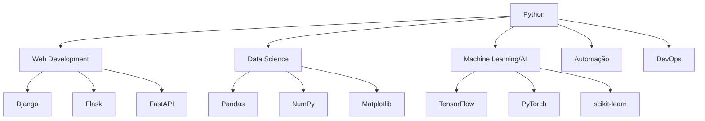
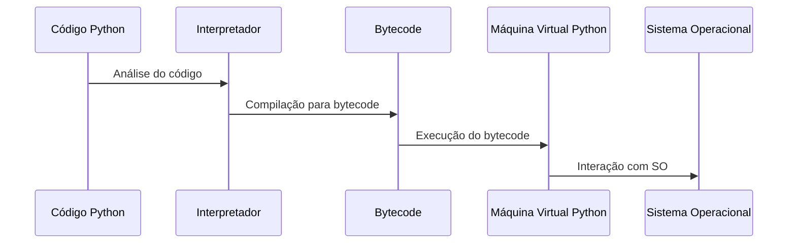
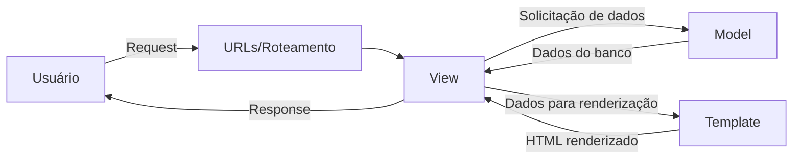
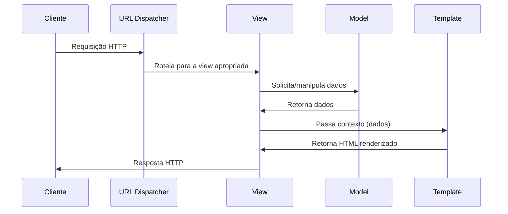
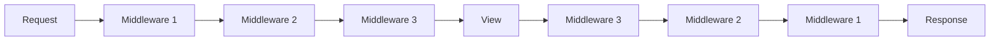
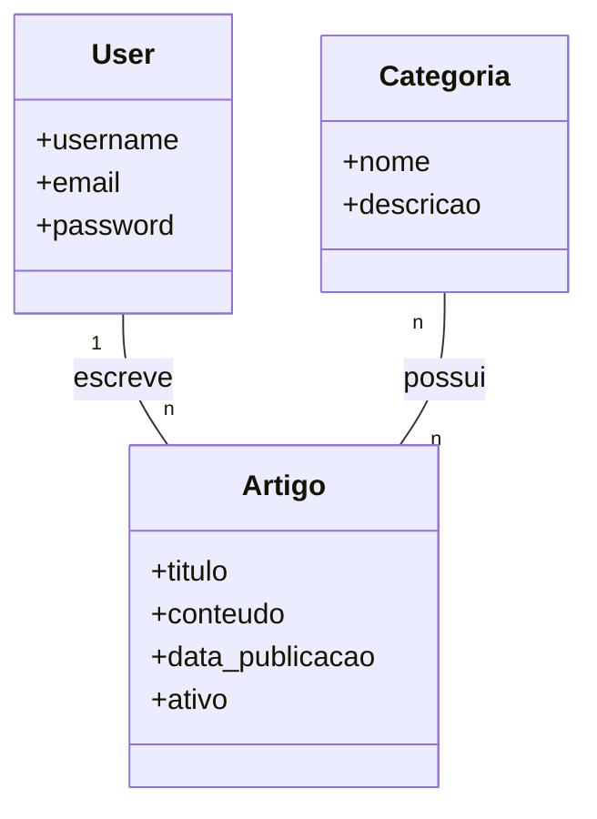

# Guia Completo de Django

## Índice
1. [Introdução ao Python](#introdução-ao-python)
2. [Fundamentos do Django](#fundamentos-do-django)
3. [Arquitetura do Django](#arquitetura-do-django)
4. [Configuração do Ambiente](#configuração-do-ambiente)
5. [Componentes Principais](#componentes-principais)
6. [Modelos e Banco de Dados](#modelos-e-banco-de-dados)
7. [Visões e Templates](#visões-e-templates)
8. [Django Admin](#django-admin)
9. [Formulários](#formulários)
10. [Autenticação e Autorização](#autenticação-e-autorização)
11. [APIs com Django](#apis-com-django)
12. [Segurança no Django](#segurança-no-django)
13. [Testes no Django](#testes-no-django)
14. [Implantação e DevOps](#implantação-e-devops)
15. [Otimização de Performance](#otimização-de-performance)
16. [Padrões e Práticas Recomendadas](#padrões-e-práticas-recomendadas)
17. [Recursos Adicionais](#recursos-adicionais)

## Introdução ao Python

### O que é Python?

Python é uma linguagem de programação de alto nível, interpretada, orientada a objetos e com semântica dinâmica. Foi criada por Guido van Rossum e lançada em 1991. Python é conhecido por sua sintaxe simples e legível, o que permite aos desenvolvedores expressarem conceitos em menos linhas de código do que seria possível em linguagens como C++ ou Java.

### Características Principais

- **Facilidade de leitura**: Sintaxe clara e legível
- **Tipagem dinâmica**: Não é necessário declarar tipos de variáveis
- **Interpretada**: Código é executado linha por linha
- **Multiplataforma**: Funciona em diversos sistemas operacionais
- **Grande biblioteca padrão**: "Batteries included"
- **Extensível**: Pode ser estendida com módulos escritos em C, C++ e outras linguagens
- **Comunidade ativa**: Grande suporte e recursos disponíveis

### Ecossistema Python



### Funcionamento do Python

Python opera através de um interpretador que lê o código linha por linha, analisa e executa as instruções. Essa é a sequência básica:



### Paradigmas de Programação em Python

Python suporta múltiplos paradigmas de programação:

- **Programação Orientada a Objetos**: Permite a criação de classes e objetos
- **Programação Funcional**: Suporte para funções de primeira classe, lambda, map, filter, etc.
- **Programação Procedural**: Execução sequencial de comandos
- **Programação Imperativa**: Especificação detalhada de cada passo da execução

## Fundamentos do Django

### O que é Django?

Django é um framework web de alto nível escrito em Python que incentiva o desenvolvimento rápido e limpo. Foi criado em 2003, originalmente para gerenciar sites de notícias, e posteriormente lançado publicamente em 2005.

### Filosofia do Django

O Django segue o princípio "DRY" (Don't Repeat Yourself) e enfatiza a reutilização de código. Seu slogan é "o framework web para perfeccionistas com prazos".

### Características Principais

- **Rapidez**: Projetado para ajudar desenvolvedores a criar aplicações rapidamente
- **Segurança**: Proteção contra vulnerabilidades comuns
- **Escalabilidade**: Pode lidar com tráfego de alto volume
- **Versatilidade**: Adequado para diversos tipos de projetos
- **Manutenibilidade**: Código bem organizado e fácil de manter
- **Admin automático**: Interface administrativa gerada automaticamente
- **ORM robusto**: Mapeamento objeto-relacional poderoso

## Arquitetura do Django

### Modelo MVT (Model-View-Template)

Django implementa uma variação do padrão MVC (Model-View-Controller) chamada MVT (Model-View-Template):



- **Model**: Define a estrutura dos dados e interage com o banco de dados
- **View**: Processa as requisições, busca dados nos models e os passa aos templates
- **Template**: Define como os dados serão apresentados ao usuário

### Fluxo de uma Requisição



### Estrutura de Projeto

A estrutura básica de um projeto Django:

```
projeto/
├── manage.py
├── projeto/
│   ├── __init__.py
│   ├── settings.py
│   ├── urls.py
│   ├── asgi.py
│   └── wsgi.py
└── aplicacao/
    ├── __init__.py
    ├── admin.py
    ├── apps.py
    ├── migrations/
    ├── models.py
    ├── tests.py
    └── views.py
```

## Configuração do Ambiente

### Instalação do Django

1. Criar um ambiente virtual:
```bash
python -m venv venv
source venv/bin/activate  # Linux/macOS
venv\Scripts\activate     # Windows
```

2. Instalar Django:
```bash
pip install django
```

3. Verificar instalação:
```bash
python -m django --version
```

### Criação de um Novo Projeto

```bash
django-admin startproject nome_do_projeto
cd nome_do_projeto
```

### Criação de uma Aplicação

```bash
python manage.py startapp nome_da_aplicacao
```

### Arquivo settings.py

O arquivo `settings.py` contém todas as configurações do projeto:

- **INSTALLED_APPS**: Lista de aplicações ativadas
- **MIDDLEWARE**: Lista de middlewares
- **DATABASES**: Configurações de banco de dados
- **TEMPLATES**: Configurações de templates
- **STATIC_URL**: URL para arquivos estáticos
- **SECRET_KEY**: Chave secreta para criptografia
- **DEBUG**: Modo de depuração
- **ALLOWED_HOSTS**: Hosts permitidos

## Componentes Principais

### URLs e Roteamento

O sistema de URLs do Django mapeia URLs para views:

```python
# projeto/urls.py
from django.urls import path, include
from django.contrib import admin

urlpatterns = [
    path('admin/', admin.site.urls),
    path('app/', include('app.urls')),
]

# app/urls.py
from django.urls import path
from . import views

urlpatterns = [
    path('', views.index, name='index'),
    path('detalhe/<int:id>/', views.detalhe, name='detalhe'),
]
```

### Views

As views processam as requisições e retornam respostas:

```python
# Função baseada em função
from django.shortcuts import render
from django.http import HttpResponse

def index(request):
    context = {'mensagem': 'Olá, mundo!'}
    return render(request, 'app/index.html', context)

# Visão baseada em classe
from django.views.generic import ListView
from .models import Artigo

class ArtigoListView(ListView):
    model = Artigo
    template_name = 'app/artigos.html'
    context_object_name = 'artigos'
```

### Templates

Os templates definem como os dados serão apresentados:

```html
<!-- base.html -->
<!DOCTYPE html>
<html>
<head>
    <title>Meu Site</title>
</head>
<body>
    
</body>
</html>

<!-- index.html -->


Página Inicial


    <h1>{{ mensagem }}</h1>
    
    
        <ul>
        
            <li>{{ artigo.titulo }}</li>
        
        </ul>
    
        <p>Nenhum artigo disponível.</p>
    

```

### Middleware

Middleware é um framework de hooks de processamento de requisição/resposta:



## Modelos e Banco de Dados

### Definição de Modelos

Os modelos definem a estrutura dos dados:

```python
from django.db import models
from django.contrib.auth.models import User

class Categoria(models.Model):
    nome = models.CharField(max_length=100)
    descricao = models.TextField(blank=True)
    
    def __str__(self):
        return self.nome

class Artigo(models.Model):
    titulo = models.CharField(max_length=200)
    conteudo = models.TextField()
    data_publicacao = models.DateTimeField(auto_now_add=True)
    autor = models.ForeignKey(User, on_delete=models.CASCADE)
    categorias = models.ManyToManyField(Categoria)
    ativo = models.BooleanField(default=True)
    
    def __str__(self):
        return self.titulo
```

### Relações entre Modelos

Django suporta diferentes tipos de relações:



- **ForeignKey**: Relação um-para-muitos
- **ManyToManyField**: Relação muitos-para-muitos
- **OneToOneField**: Relação um-para-um

### Migrações

Migrações gerenciam alterações no esquema do banco de dados:

```bash
# Criar arquivo de migração
python manage.py makemigrations

# Aplicar migrações
python manage.py migrate

# Ver status das migrações
python manage.py showmigrations
```

### QuerySet API

A API QuerySet permite interagir com o banco de dados:

```python
# Buscar todos os registros
artigos = Artigo.objects.all()

# Filtrar registros
artigos_ativos = Artigo.objects.filter(ativo=True)

# Ordenar registros
artigos_recentes = Artigo.objects.order_by('-data_publicacao')

# Limitar resultados
cinco_artigos = Artigo.objects.all()[:5]

# Buscar registro único
artigo = Artigo.objects.get(id=1)

# Criar registro
artigo = Artigo.objects.create(
    titulo='Novo Artigo',
    conteudo='Conteúdo do artigo',
    autor=usuario
)

# Atualizar registro
artigo.titulo = 'Título atualizado'
artigo.save()

# Excluir registro
artigo.delete()
```

## Visões e Templates

### Tipos de Views

Django suporta dois tipos principais de views:

1. **Views Baseadas em Função (FBV)**:
   - Simples e diretas
   - Mais flexíveis para lógica complexa
   - Mais código para funcionalidade padrão

2. **Views Baseadas em Classe (CBV)**:
   - Menos código repetitivo
   - Herança para reutilização
   - Views genéricas para operações comuns

```python
# Views baseadas em classe genéricas
from django.views.generic import (
    ListView, DetailView, CreateView, UpdateView, DeleteView
)

class ArtigoListView(ListView):
    model = Artigo
    template_name = 'app/artigo_list.html'
    context_object_name = 'artigos'
    paginate_by = 10
    
class ArtigoDetailView(DetailView):
    model = Artigo
    template_name = 'app/artigo_detail.html'
    
class ArtigoCreateView(CreateView):
    model = Artigo
    fields = ['titulo', 'conteudo', 'categorias']
    success_url = '/artigos/'
```

### Sistema de Templates

O sistema de templates do Django:

1. **Tags de Template**:
   - ``, ``, ``
   - ``, ``
   - ``

2. **Filtros**:
   - `{{ valor|lower }}`, `{{ valor|date:"Y-m-d" }}`
   - `{{ valor|default:"Não disponível" }}`

3. **Herança de Templates**:
   - ``
   - ``

4. **Inclusão de Templates**:
   - ``

### Arquivos Estáticos

Gerenciamento de arquivos estáticos:

```python
# settings.py
STATIC_URL = '/static/'
STATICFILES_DIRS = [BASE_DIR / 'static']
STATIC_ROOT = BASE_DIR / 'staticfiles'
```

```html

<link rel="stylesheet" href="">

```

## Django Admin

### Configuração Básica

```python
# admin.py
from django.contrib import admin
from .models import Categoria, Artigo

admin.site.register(Categoria)
admin.site.register(Artigo)
```

### Personalização do Admin

```python
@admin.register(Artigo)
class ArtigoAdmin(admin.ModelAdmin):
    list_display = ('titulo', 'autor', 'data_publicacao', 'ativo')
    list_filter = ('ativo', 'data_publicacao', 'categorias')
    search_fields = ('titulo', 'conteudo')
    date_hierarchy = 'data_publicacao'
    filter_horizontal = ('categorias',)
    readonly_fields = ('data_publicacao',)
    fieldsets = (
        ('Informações Básicas', {
            'fields': ('titulo', 'conteudo')
        }),
        ('Metadados', {
            'fields': ('autor', 'categorias', 'data_publicacao', 'ativo')
        }),
    )
```

### Ações Personalizadas

```python
@admin.register(Artigo)
class ArtigoAdmin(admin.ModelAdmin):
    # ...
    actions = ['marcar_como_ativo', 'marcar_como_inativo']
    
    def marcar_como_ativo(self, request, queryset):
        queryset.update(ativo=True)
    marcar_como_ativo.short_description = "Marcar artigos selecionados como ativos"
    
    def marcar_como_inativo(self, request, queryset):
        queryset.update(ativo=False)
    marcar_como_inativo.short_description = "Marcar artigos selecionados como inativos"
```

## Formulários

### Formulários do Django

```python
# forms.py
from django import forms
from .models import Artigo

class ArtigoForm(forms.ModelForm):
    class Meta:
        model = Artigo
        fields = ['titulo', 'conteudo', 'categorias']
        widgets = {
            'titulo': forms.TextInput(attrs={'class': 'form-control'}),
            'conteudo': forms.Textarea(attrs={'class': 'form-control'}),
            'categorias': forms.CheckboxSelectMultiple(),
        }
        
# views.py
def criar_artigo(request):
    if request.method == 'POST':
        form = ArtigoForm(request.POST)
        if form.is_valid():
            artigo = form.save(commit=False)
            artigo.autor = request.user
            artigo.save()
            form.save_m2m()  # Salvar relações muitos-para-muitos
            return redirect('artigo_detalhe', pk=artigo.pk)
    else:
        form = ArtigoForm()
    return render(request, 'app/artigo_form.html', {'form': form})
```

### Validação de Formulários

```python
class ArtigoForm(forms.ModelForm):
    # ...
    
    def clean_titulo(self):
        titulo = self.cleaned_data['titulo']
        if len(titulo) < 5:
            raise forms.ValidationError("O título deve ter pelo menos 5 caracteres.")
        return titulo
    
    def clean(self):
        cleaned_data = super().clean()
        titulo = cleaned_data.get('titulo')
        conteudo = cleaned_data.get('conteudo')
        
        if titulo and conteudo and titulo in conteudo:
            raise forms.ValidationError("O título não deve estar contido no conteúdo.")
        
        return cleaned_data
```

### Formulários de Criação de Usuário

```python
from django.contrib.auth.forms import UserCreationForm
from django.contrib.auth.models import User

class RegistroForm(UserCreationForm):
    email = forms.EmailField(max_length=254, required=True)
    
    class Meta:
        model = User
        fields = ('username', 'email', 'password1', 'password2')
```

## Autenticação e Autorização

### Sistema de Autenticação

```python
# views.py
from django.contrib.auth import authenticate, login, logout
from django.contrib.auth.decorators import login_required

def login_view(request):
    if request.method == 'POST':
        username = request.POST['username']
        password = request.POST['password']
        user = authenticate(request, username=username, password=password)
        if user is not None:
            login(request, user)
            return redirect('home')
        else:
            return render(request, 'login.html', {'error': 'Credenciais inválidas'})
    return render(request, 'login.html')

def logout_view(request):
    logout(request)
    return redirect('login')

@login_required
def perfil(request):
    return render(request, 'perfil.html')
```

### Permissões e Grupos

```python
from django.contrib.auth.mixins import PermissionRequiredMixin

class ArtigoCreateView(PermissionRequiredMixin, CreateView):
    model = Artigo
    fields = ['titulo', 'conteudo', 'categorias']
    permission_required = 'app.add_artigo'
    
    def form_valid(self, form):
        form.instance.autor = self.request.user
        return super().form_valid(form)
```

### Controle de Acesso

```python
# Decorador para visões baseadas em função
@login_required
def editar_artigo(request, pk):
    # ...

# Mixins para visões baseadas em classe
from django.contrib.auth.mixins import (
    LoginRequiredMixin, UserPassesTestMixin
)

class ArtigoUpdateView(LoginRequiredMixin, UserPassesTestMixin, UpdateView):
    model = Artigo
    fields = ['titulo', 'conteudo', 'categorias']
    
    def test_func(self):
        artigo = self.get_object()
        return self.request.user == artigo.autor
```

## APIs com Django

### Django Rest Framework

```bash
pip install djangorestframework
```

```python
# settings.py
INSTALLED_APPS = [
    # ...
    'rest_framework',
]

# serializers.py
from rest_framework import serializers
from .models import Artigo

class ArtigoSerializer(serializers.ModelSerializer):
    class Meta:
        model = Artigo
        fields = ['id', 'titulo', 'conteudo', 'data_publicacao', 'autor', 'categorias']
        
# views.py
from rest_framework import viewsets
from .models import Artigo
from .serializers import ArtigoSerializer

class ArtigoViewSet(viewsets.ModelViewSet):
    queryset = Artigo.objects.all()
    serializer_class = ArtigoSerializer
    
# urls.py
from rest_framework.routers import DefaultRouter
from .views import ArtigoViewSet

router = DefaultRouter()
router.register('artigos', ArtigoViewSet)

urlpatterns = [
    # ...
    path('api/', include(router.urls)),
]
```

### Django Ninja

```bash
pip install django-ninja
```

```python
# api.py
from ninja import NinjaAPI, Schema
from .models import Artigo

api = NinjaAPI()

class ArtigoSchema(Schema):
    id: int
    titulo: str
    conteudo: str
    
class ArtigoInSchema(Schema):
    titulo: str
    conteudo: str

@api.get('/artigos', response=list[ArtigoSchema])
def listar_artigos(request):
    return Artigo.objects.all()

@api.get('/artigos/{artigo_id}', response=ArtigoSchema)
def obter_artigo(request, artigo_id: int):
    return Artigo.objects.get(id=artigo_id)

@api.post('/artigos', response=ArtigoSchema)
def criar_artigo(request, payload: ArtigoInSchema):
    artigo = Artigo.objects.create(
        titulo=payload.titulo,
        conteudo=payload.conteudo,
        autor=request.user
    )
    return artigo

# urls.py
from django.urls import path
from .api import api

urlpatterns = [
    # ...
    path('api/', api.urls),
]
```

## Segurança no Django

### CSRF Protection

```html
<form method="post">
    
    {{ form.as_p }}
    <button type="submit">Enviar</button>
</form>
```

### Proteção contra SQL Injection

O ORM do Django protege automaticamente contra SQL Injection ao usar QuerySets:

```python
# Seguro
usuario = User.objects.get(username=username)

# Inseguro - NUNCA FAÇA ISSO!
usuario = User.objects.raw(f"SELECT * FROM auth_user WHERE username = '{username}'")
```

### Proteção contra XSS

Django escapa automaticamente conteúdo em templates:

```html
<!-- Seguro -->
{{ artigo.conteudo }}

<!-- Inseguro - use apenas se tiver certeza que o conteúdo é seguro -->
{{ artigo.conteudo|safe }}
```

### Configurações de Segurança

```python
# settings.py
SECURE_BROWSER_XSS_FILTER = True
SECURE_CONTENT_TYPE_NOSNIFF = True
SECURE_SSL_REDIRECT = True  # Em produção
SESSION_COOKIE_SECURE = True  # Em produção
CSRF_COOKIE_SECURE = True  # Em produção
X_FRAME_OPTIONS = 'DENY'
```

## Testes no Django

### Testes Unitários

```python
# tests.py
from django.test import TestCase
from django.contrib.auth.models import User
from .models import Artigo

class ArtigoModelTest(TestCase):
    @classmethod
    def setUpTestData(cls):
        # Configuração que é executada apenas uma vez
        test_user = User.objects.create_user(username='testuser', password='12345')
        Artigo.objects.create(
            titulo='Título de teste',
            conteudo='Conteúdo de teste',
            autor=test_user
        )
    
    def test_titulo_max_length(self):
        artigo = Artigo.objects.get(id=1)
        max_length = artigo._meta.get_field('titulo').max_length
        self.assertEqual(max_length, 200)
    
    def test_object_name_is_titulo(self):
        artigo = Artigo.objects.get(id=1)
        self.assertEqual(str(artigo), artigo.titulo)
```

### Testes de Visão

```python
from django.test import TestCase
from django.urls import reverse

class ArtigoListViewTest(TestCase):
    @classmethod
    def setUpTestData(cls):
        # Criar artigos para testes
        test_user = User.objects.create_user(username='testuser', password='12345')
        for i in range(10):
            Artigo.objects.create(
                titulo=f'Título {i}',
                conteudo=f'Conteúdo {i}',
                autor=test_user
            )
    
    def test_view_url_exists(self):
        response = self.client.get('/artigos/')
        self.assertEqual(response.status_code, 200)
    
    def test_view_url_accessible_by_name(self):
        response = self.client.get(reverse('artigo_list'))
        self.assertEqual(response.status_code, 200)
    
    def test_view_uses_correct_template(self):
        response = self.client.get(reverse('artigo_list'))
        self.assertEqual(response.status_code, 200)
        self.assertTemplateUsed(response, 'app/artigo_list.html')
    
    def test_pagination_is_five(self):
        response = self.client.get(reverse('artigo_list'))
        self.assertEqual(response.status_code, 200)
        self.assertTrue('is_paginated' in response.context)
        self.assertTrue(response.context['is_paginated'] == True)
        self.assertEqual(len(response.context['artigos']), 5)
```

### Teste de Formulários

```python
from django.test import TestCase
from .forms import ArtigoForm

class ArtigoFormTest(TestCase):
    def test_form_titulo_field_label(self):
        form = ArtigoForm()
        self.assertTrue(form.fields['titulo'].label == 'Título' or form.fields['titulo'].label == None)
    
    def test_form_validation_for_blank_titulo(self):
        form = ArtigoForm(data={'titulo': '', 'conteudo': 'Conteúdo de teste'})
        self.assertFalse(form.is_valid())
    
    def test_form_validation_for_short_titulo(self):
        form = ArtigoForm(data={'titulo': 'Abc', 'conteudo': 'Conteúdo de teste'})
        self.assertFalse(form.is_valid())
```

## Implantação e DevOps

### Preparação para Produção

```python
# settings.py
DEBUG = False
ALLOWED_HOSTS = ['seudominio.com', 'www.seudominio.com']

# Arquivos estáticos
STATIC_ROOT = '/caminho/para/staticfiles/'
MEDIA_ROOT = '/caminho/para/mediafiles/'

# Configurações de banco de dados
DATABASES = {
    'default': {
        'ENGINE': 'django.db.backends.postgresql',
        'NAME': 'nome_do_banco',
        'USER': 'usuario',
        'PASSWORD': 'senha',
        'HOST': 'localhost',
        'PORT': '5432',
    }
}
```

### Servidor Web e WSGI

```
# Estrutura típica
Cliente <-> Nginx <-> Gunicorn <-> Django
```

```bash
# Instalação
pip install gunicorn

# Executar
gunicorn projeto.wsgi:application --bind 0.0.0.0:8000
```

### Docker e Django

```dockerfile
# Dockerfile
FROM python:3.9-slim

WORKDIR /app

COPY requirements.txt .
RUN pip install --no-cache-dir -r requirements.txt

COPY . .

EXPOSE 8000

CMD ["gunicorn", "projeto.wsgi:application", "--bind", "0.0.0.0:8000"]
```

```yaml
# docker-compose.yml
version: '3'

services:
  db:
    image: postgres:13
    volumes:
      - postgres_data:/var/lib/postgresql/data/
    env_file:
      - ./.env.db
  
  web:
    build: .
    command: gunicorn projeto.wsgi:application --bind 0.0.0.0:8000
    volumes:
      - .:/app
      - static_volume:/app/staticfiles
      - media_volume:/app/mediafiles
    ports:
      - "8000:8000"
    depends_on:
      - db
    env_file:
      - ./.env
  
  nginx:
    image: nginx:latest
    ports:
      - "80:80"
    volumes:
      - ./nginx/conf.d:/etc/nginx/conf.d
      - static_volume:/home/app/staticfiles
      - media_volume:/home/app/mediafiles
    depends_on:
      - web

volumes:
  postgres_data:
  static_volume:
  media_volume:
```

## Otimização de Performance

### Otimização de Consultas

```python
# Consultas N+1
# Problema:
artigos = Artigo.objects.all()
for artigo in artigos:
    print(artigo.autor.username)  # Gera uma consulta para cada artigo

# Solução:
artigos = Artigo.objects.select_related('autor').all()
for artigo in artigos:
    print(artigo.autor.username)  # Usa dados já carregados
```

```python
# Para relações ManyToMany
# Problema:
artigos = Artigo.objects.all()
for artigo in artigos:
    print([c.nome for c in artigo.categorias.all()])  # Consulta para cada artigo

# Solução:
artigos = Artigo.objects.prefetch_related('categorias').all()
for artigo in artigos:
    print([c.nome for c in artigo.categorias.all()])  # Usa dados já carregados
```

### Indexação de Banco de Dados

```python
class Artigo(models.Model):
    titulo = models.CharField(max_length=200)
    slug = models.SlugField(max_length=200, unique=True)
    data_publicacao = models.DateTimeField(auto_now_add=True, db_index=True)
    
    class Meta:
        indexes = [
            models.Index(fields=['titulo']),
            models.Index(fields=['data_publicacao', 'titulo']),
        ]
```

### Caching

```python
# settings.py
CACHES = {
    'default': {
        'BACKEND': 'django.core.cache.backends.redis.RedisCache',
        'LOCATION': 'redis://127.0.0.1:6379/1',
    }
}

# Cache de visão
from django.views.decorators.cache import cache_page

@cache_page(60 * 15)  # Cache por 15 minutos
def lista_artigos(request):
    artigos = Artigo.objects.all()
    return render(request, 'app/lista_artigos.html', {'artigos': artigos})

# Cache de template


    {# Conteúdo que será cacheado #}


# Cache de consulta
from django.core.cache import cache

def get_artigos_populares():
    cache_key = 'artigos_populares'
    artigos = cache.get(cache_key)
    if not artigos:
        artigos = Artigo.objects.filter(popular=True)[:10]
        cache.set(cache_key, artigos, 60 * 60)  # Cache por 1 hora
    return artigos
```

### Otimização de Arquivos Estáticos

```python
# settings.py
STATICFILES_STORAGE = 'django.contrib.staticfiles.storage.ManifestStaticFilesStorage'
```

```bash
# Coletar arquivos estáticos
python manage.py collectstatic

# Compressão de arquivos estáticos
pip install django-compressor

# settings.py
INSTALLED_APPS = [
    # ...
    'compressor',
]

STATICFILES_FINDERS = [
    'django.contrib.staticfiles.finders.FileSystemFinder',
    'django.contrib.staticfiles.finders.AppDirectoriesFinder',
    'compressor.finders.CompressorFinder',
]

COMPRESS_ENABLED = True
COMPRESS_CSS_FILTERS = ['compressor.filters.css_default.CssAbsoluteFilter', 'compressor.filters.cssmin.CSSMinFilter']
COMPRESS_JS_FILTERS = ['compressor.filters.jsmin.JSMinFilter']
```

```html



<link rel="stylesheet" href="">
<link rel="stylesheet" href="">



<script src=""></script>
<script src=""></script>

```

### Paginação

```python
from django.core.paginator import Paginator

def lista_artigos(request):
    artigos_lista = Artigo.objects.all()
    paginator = Paginator(artigos_lista, 10)  # 10 artigos por página
    
    page = request.GET.get('page')
    artigos = paginator.get_page(page)
    
    return render(request, 'app/lista_artigos.html', {'artigos': artigos})
```

```html
<div class="pagination">
    <span class="step-links">
        
            <a href="?page=1">&laquo; primeira</a>
            <a href="?page={{ artigos.previous_page_number }}">anterior</a>
        

        <span class="current">
            Página {{ artigos.number }} de {{ artigos.paginator.num_pages }}.
        </span>

        
            <a href="?page={{ artigos.next_page_number }}">próxima</a>
            <a href="?page={{ artigos.paginator.num_pages }}">última &raquo;</a>
        
    </span>
</div>
```

### Monitoramento de Performance

```python
# Instalação
pip install django-debug-toolbar

# settings.py
INSTALLED_APPS = [
    # ...
    'debug_toolbar',
]

MIDDLEWARE = [
    # ...
    'debug_toolbar.middleware.DebugToolbarMiddleware',
]

INTERNAL_IPS = [
    '127.0.0.1',
]

# urls.py
if settings.DEBUG:
    import debug_toolbar
    urlpatterns = [
        path('__debug__/', include(debug_toolbar.urls)),
    ] + urlpatterns
```

## Padrões e Práticas Recomendadas

### Estrutura de Projeto

```
projeto/
├── apps/                  # Todas as aplicações do projeto
│   ├── core/              # Funcionalidades centrais
│   ├── users/             # Gerenciamento de usuários
│   └── blog/              # Funcionalidades de blog
├── config/                # Configurações do projeto
│   ├── settings/
│   │   ├── base.py        # Configurações base
│   │   ├── local.py       # Configurações de desenvolvimento
│   │   └── production.py  # Configurações de produção
│   ├── urls.py
│   └── wsgi.py
├── static/                # Arquivos estáticos
├── templates/             # Templates globais
├── media/                 # Arquivos de mídia
├── docs/                  # Documentação
├── requirements/
│   ├── base.txt           # Dependências base
│   ├── local.txt          # Dependências de desenvolvimento
│   └── production.txt     # Dependências de produção
├── manage.py
└── README.md
```

### Padrões de Código

```python
# Nomes de classes em CamelCase
class MinhaClasse:
    pass

# Nomes de funções e variáveis em snake_case
def minha_funcao():
    minha_variavel = 10
    return minha_variavel

# Constantes em MAIÚSCULAS
NUMERO_MAXIMO_DE_TENTATIVAS = 3

# Docstrings para documentação
def calcular_total(valores):
    """
    Calcula a soma de uma lista de valores.
    
    Args:
        valores (list): Lista de números para somar.
        
    Returns:
        float: A soma dos valores.
        
    Raises:
        TypeError: Se valores não for uma lista ou se contiver elementos não numéricos.
    """
    return sum(valores)
```

### Fat Models, Thin Views

```python
# models.py - Lógica de negócio no modelo
class Artigo(models.Model):
    # ...
    
    def publicar(self):
        self.status = 'publicado'
        self.data_publicacao = timezone.now()
        self.save()
    
    def despublicar(self):
        self.status = 'rascunho'
        self.save()
    
    def get_comentarios_aprovados(self):
        return self.comentarios.filter(aprovado=True)
    
    def get_categorias_ordenadas(self):
        return self.categorias.order_by('nome')

# views.py - View simples que usa métodos do modelo
def publicar_artigo(request, pk):
    artigo = get_object_or_404(Artigo, pk=pk)
    if request.user == artigo.autor:
        artigo.publicar()
    return redirect('artigo_detalhe', pk=artigo.pk)
```

### Service Layer

```python
# services.py
class ArtigoService:
    @staticmethod
    def criar_artigo(titulo, conteudo, autor, categorias=None):
        artigo = Artigo.objects.create(
            titulo=titulo,
            conteudo=conteudo,
            autor=autor
        )
        
        if categorias:
            artigo.categorias.add(*categorias)
        
        # Enviar notificação, gerar log, etc.
        
        return artigo
    
    @staticmethod
    def publicar_artigo(artigo_id, usuario):
        artigo = Artigo.objects.get(id=artigo_id)
        
        if usuario != artigo.autor and not usuario.is_staff:
            raise PermissionError("Usuário não tem permissão para publicar este artigo")
        
        artigo.publicar()
        
        # Enviar e-mail, notificar seguidores, etc.
        
        return artigo

# views.py
def criar_artigo(request):
    if request.method == 'POST':
        form = ArtigoForm(request.POST)
        if form.is_valid():
            try:
                artigo = ArtigoService.criar_artigo(
                    titulo=form.cleaned_data['titulo'],
                    conteudo=form.cleaned_data['conteudo'],
                    autor=request.user,
                    categorias=form.cleaned_data['categorias']
                )
                return redirect('artigo_detalhe', pk=artigo.pk)
            except Exception as e:
                form.add_error(None, str(e))
    else:
        form = ArtigoForm()
    return render(request, 'app/artigo_form.html', {'form': form})
```

### Signals para Desacoplamento

```python
# signals.py
from django.db.models.signals import post_save
from django.dispatch import receiver
from .models import Artigo

@receiver(post_save, sender=Artigo)
def artigo_post_save(sender, instance, created, **kwargs):
    if created:
        # Lógica para novo artigo
        pass
    else:
        # Lógica para artigo atualizado
        pass

# apps.py
from django.apps import AppConfig

class BlogConfig(AppConfig):
    default_auto_field = 'django.db.models.BigAutoField'
    name = 'blog'
    
    def ready(self):
        import blog.signals  # Importar signals quando a aplicação estiver pronta
```

### Mixins para Reutilização

```python
class OwnerRequiredMixin:
    """Mixin que verifica se o usuário é dono do objeto."""
    
    def dispatch(self, request, *args, **kwargs):
        obj = self.get_object()
        if obj.autor != request.user:
            return self.handle_no_permission()
        return super().dispatch(request, *args, **kwargs)

class ArtigoUpdateView(LoginRequiredMixin, OwnerRequiredMixin, UpdateView):
    model = Artigo
    fields = ['titulo', 'conteudo', 'categorias']
    template_name = 'app/artigo_form.html'
```

### Gerenciamento de Configurações

```python
# settings/base.py
import os
from pathlib import Path
from decouple import config, Csv

BASE_DIR = Path(__file__).resolve().parent.parent.parent

SECRET_KEY = config('SECRET_KEY')

INSTALLED_APPS = [
    'django.contrib.admin',
    'django.contrib.auth',
    'django.contrib.contenttypes',
    'django.contrib.sessions',
    'django.contrib.messages',
    'django.contrib.staticfiles',
    
    # Apps de terceiros
    'rest_framework',
    'crispy_forms',
    
    # Apps do projeto
    'apps.core',
    'apps.users',
    'apps.blog',
]

# settings/local.py
from .base import *

DEBUG = True
ALLOWED_HOSTS = ['localhost', '127.0.0.1']

DATABASES = {
    'default': {
        'ENGINE': 'django.db.backends.sqlite3',
        'NAME': BASE_DIR / 'db.sqlite3',
    }
}

# settings/production.py
from .base import *

DEBUG = False
ALLOWED_HOSTS = config('ALLOWED_HOSTS', cast=Csv())

DATABASES = {
    'default': {
        'ENGINE': 'django.db.backends.postgresql',
        'NAME': config('DB_NAME'),
        'USER': config('DB_USER'),
        'PASSWORD': config('DB_PASSWORD'),
        'HOST': config('DB_HOST'),
        'PORT': config('DB_PORT', cast=int),
    }
}

# Configurações de segurança
SECURE_SSL_REDIRECT = True
SESSION_COOKIE_SECURE = True
CSRF_COOKIE_SECURE = True
```

## Recursos Adicionais

### Documentação Oficial

- [Documentação do Django](https://docs.djangoproject.com/)
- [Tutorial do Django](https://docs.djangoproject.com/en/stable/intro/tutorial01/)
- [Referência da API do Django](https://docs.djangoproject.com/en/stable/ref/)
- [Tópicos Avançados do Django](https://docs.djangoproject.com/en/stable/topics/)

### Livros Recomendados

- "Django for Professionals" por William S. Vincent
- "Two Scoops of Django" por Daniel Roy Greenfeld e Audrey Roy Greenfeld
- "Django 3 By Example" por Antonio Melé
- "Test-Driven Development with Python" por Harry Percival

### Cursos Online

- [Django for Everybody](https://www.dj4e.com/) por Charles Severance
- [Django Web Framework - Full Course for Beginners](https://www.youtube.com/watch?v=F5mRW0jo-U4) por freeCodeCamp
- [Django - The Complete Masterclass](https://www.udemy.com/course/django-the-complete-masterclass/) na Udemy
- [Django for APIs](https://djangoforapis.com/) por William S. Vincent

### Blogs e Sites

- [Django News](https://django-news.com/)
- [Django Stars Blog](https://djangostars.com/blog/)
- [Real Python - Django Tutorials](https://realpython.com/tutorials/django/)
- [Awesome Django](https://github.com/wsvincent/awesome-django) - Lista curada de recursos

### Pacotes e Extensões Úteis

- [Django REST Framework](https://www.django-rest-framework.org/) - Criação de APIs
- [Django Crispy Forms](https://django-crispy-forms.readthedocs.io/) - Formulários elegantes
- [Django Debug Toolbar](https://django-debug-toolbar.readthedocs.io/) - Depuração
- [Django Allauth](https://django-allauth.readthedocs.io/) - Autenticação avançada
- [Django Filter](https://django-filter.readthedocs.io/) - Filtragem de querysets
- [Django Channels](https://channels.readthedocs.io/) - WebSockets e comunicação assíncrona
- [Django Celery](https://docs.celeryq.dev/en/stable/django/first-steps-with-django.html) - Tarefas assíncronas
- [Django Storages](https://django-storages.readthedocs.io/) - Armazenamento em nuvem

### Comunidade

- [Django Forum](https://forum.djangoproject.com/)
- [Stack Overflow - Tag Django](https://stackoverflow.com/questions/tagged/django)
- [Reddit r/django](https://www.reddit.com/r/django/)
- [Discord Django Community](https://discord.com/invite/xcRH6mN4fa)
- [Django Chat Podcast](https://djangochat.com/)

### Conferências

- [DjangoCon US](https://djangocon.us/)
- [DjangoCon Europe](https://djangocon.eu/)
- [DjangoCon Australia](https://djangocon.com.au/)
- [PyCon (várias edições globais)](https://pycon.org/)

### Contribuindo para o Django

- [Contribuindo para o Django](https://docs.djangoproject.com/en/stable/internals/contributing/)
- [Código de Conduta do Django](https://www.djangoproject.com/conduct/)
- [Repositório do Django no GitHub](https://github.com/django/django)
- [Django Software Foundation](https://www.djangoproject.com/foundation/)
