# Guia Completo de Django

## Índice
1. [Introdução ao Python](#introdução-ao-python)
2. [Fundamentos do Django](#fundamentos-do-django)
3. [Arquitetura do Django](#arquitetura-do-django)
4. [Configuração do Ambiente](#configuração-do-ambiente)
5. [Componentes Principais](#componentes-principais)
6. [Modelos e Banco de Dados](#modelos-e-banco-de-dados)
7. [Visões e Templates](#visões-e-templates)
8. [Django Admin](#django-admin)
9. [Formulários](#formulários)
10. [Autenticação e Autorização](#autenticação-e-autorização)
11. [APIs com Django](#apis-com-django)
12. [Segurança no Django](#segurança-no-django)
13. [Testes no Django](#testes-no-django)
14. [Implantação e DevOps](#implantação-e-devops)
15. [Otimização de Performance](#otimização-de-performance)
16. [Padrões e Práticas Recomendadas](#padrões-e-práticas-recomendadas)
17. [Recursos Adicionais](#recursos-adicionais)

## Introdução ao Python

### O que é Python?

Python é uma linguagem de programação de alto nível, interpretada, orientada a objetos e com semântica dinâmica. Foi criada por Guido van Rossum e lançada em 1991. Python é conhecido por sua sintaxe simples e legível, o que permite aos desenvolvedores expressarem conceitos em menos linhas de código do que seria possível em linguagens como C++ ou Java.

### Características Principais

- **Facilidade de leitura**: Sintaxe clara e legível
- **Tipagem dinâmica**: Não é necessário declarar tipos de variáveis
- **Interpretada**: Código é executado linha por linha
- **Multiplataforma**: Funciona em diversos sistemas operacionais
- **Grande biblioteca padrão**: "Batteries included"
- **Extensível**: Pode ser estendida com módulos escritos em C, C++ e outras linguagens
- **Comunidade ativa**: Grande suporte e recursos disponíveis

### Ecossistema Python

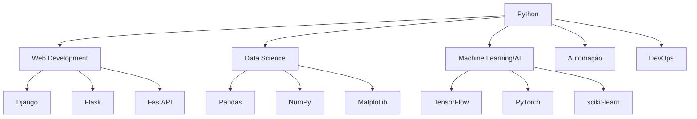

### Funcionamento do Python

Python opera através de um interpretador que lê o código linha por linha, analisa e executa as instruções. Essa é a sequência básica:

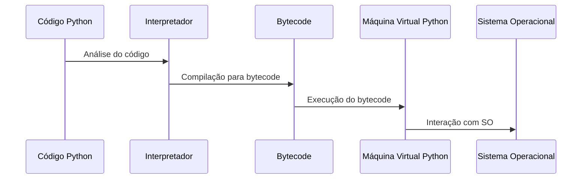

### Paradigmas de Programação em Python

Python suporta múltiplos paradigmas de programação:

- **Programação Orientada a Objetos**: Permite a criação de classes e objetos
- **Programação Funcional**: Suporte para funções de primeira classe, lambda, map, filter, etc.
- **Programação Procedural**: Execução sequencial de comandos
- **Programação Imperativa**: Especificação detalhada de cada passo da execução

## Fundamentos do Django

### O que é Django?

Django é um framework web de alto nível escrito em Python que incentiva o desenvolvimento rápido e limpo. Foi criado em 2003, originalmente para gerenciar sites de notícias, e posteriormente lançado publicamente em 2005.

### Filosofia do Django

O Django segue o princípio "DRY" (Don't Repeat Yourself) e enfatiza a reutilização de código. Seu slogan é "o framework web para perfeccionistas com prazos".

### Características Principais

- **Rapidez**: Projetado para ajudar desenvolvedores a criar aplicações rapidamente
- **Segurança**: Proteção contra vulnerabilidades comuns
- **Escalabilidade**: Pode lidar com tráfego de alto volume
- **Versatilidade**: Adequado para diversos tipos de projetos
- **Manutenibilidade**: Código bem organizado e fácil de manter
- **Admin automático**: Interface administrativa gerada automaticamente
- **ORM robusto**: Mapeamento objeto-relacional poderoso

## Arquitetura do Django

### Modelo MVT (Model-View-Template)

Django implementa uma variação do padrão MVC (Model-View-Controller) chamada MVT (Model-View-Template):

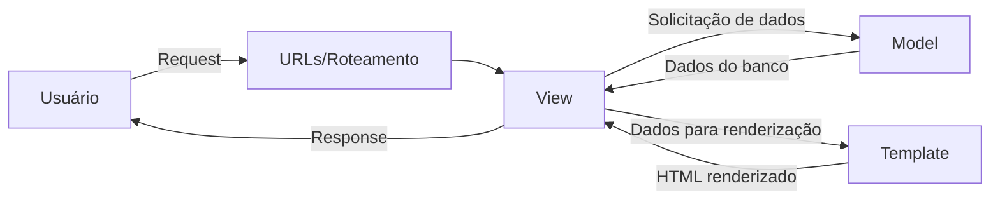

- **Model**: Define a estrutura dos dados e interage com o banco de dados
- **View**: Processa as requisições, busca dados nos models e os passa aos templates
- **Template**: Define como os dados serão apresentados ao usuário

### Fluxo de uma Requisição

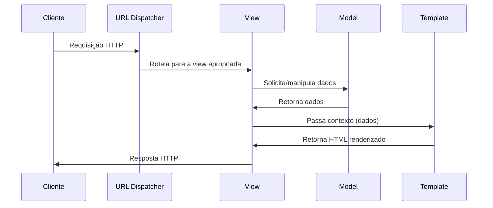

### Estrutura de Projeto

O Django organiza o código em projetos e aplicações. Um projeto pode conter múltiplas aplicações, e cada aplicação deve focar em uma funcionalidade específica.

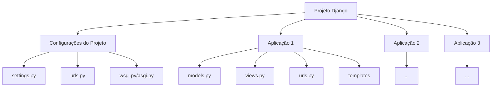

A estrutura básica será detalhada nas seções de criação de projeto e aplicações.

## Configuração do Ambiente

### Instalação do Django

1. Criar um ambiente virtual:
```bash
python -m venv venv
source venv/bin/activate  # Linux/macOS
venv\Scripts\activate     # Windows
```

2. Instalar Django:
```bash
pip install django
```

3. Verificar instalação:
```bash
python -m django --version
```

### Criação de um Novo Projeto

```bash
django-admin startproject nome_do_projeto
cd nome_do_projeto
```

Após a criação, o projeto terá a seguinte estrutura:

```
nome_do_projeto/
├── manage.py
└── nome_do_projeto/
    ├── __init__.py
    ├── asgi.py
    ├── settings.py
    ├── urls.py
    └── wsgi.py
```

#### Explicação dos Arquivos Principais

- **manage.py**: Utilitário de linha de comando que permite interagir com o projeto Django. Usado para executar comandos como `runserver`, `makemigrations`, `migrate`, etc.

- **nome_do_projeto/__init__.py**: Arquivo vazio que indica ao Python que este diretório deve ser considerado um pacote Python.

- **nome_do_projeto/settings.py**: Contém todas as configurações do projeto. Aqui você define o banco de dados, aplicações instaladas, middleware, configurações de internacionalização, etc.

- **nome_do_projeto/urls.py**: Arquivo de configuração de URLs do projeto. Define as rotas principais e pode incluir URLs de aplicações.

- **nome_do_projeto/asgi.py**: Ponto de entrada para servidores web compatíveis com ASGI (Asynchronous Server Gateway Interface).

- **nome_do_projeto/wsgi.py**: Ponto de entrada para servidores web compatíveis com WSGI (Web Server Gateway Interface).

#### Executando o Servidor de Desenvolvimento

```bash
python manage.py runserver
```

Isso iniciará o servidor de desenvolvimento em http://127.0.0.1:8000/.

### Criação de uma Aplicação

```bash
python manage.py startapp nome_da_aplicacao
```

Após a criação, a aplicação terá a seguinte estrutura:

```
nome_da_aplicacao/
├── __init__.py
├── admin.py
├── apps.py
├── migrations/
│   └── __init__.py
├── models.py
├── tests.py
└── views.py
```

#### Explicação dos Arquivos Principais

- **__init__.py**: Arquivo vazio que indica ao Python que este diretório deve ser considerado um pacote Python.

- **admin.py**: Configuração para o Django Admin. Aqui você registra seus modelos para que apareçam na interface administrativa.

- **apps.py**: Configuração da aplicação. Contém a classe `AppConfig` que permite personalizar alguns aspectos da aplicação.

- **migrations/**: Diretório que armazena as migrações do banco de dados para esta aplicação.

- **models.py**: Define os modelos de dados da aplicação, que serão convertidos em tabelas no banco de dados.

- **tests.py**: Arquivo para escrever testes unitários e de integração.

- **views.py**: Contém as funções ou classes que processam as requisições HTTP e retornam respostas.

#### Arquivos Adicionais Comuns (que você pode criar)

- **urls.py**: Define as URLs específicas da aplicação.
- **forms.py**: Define formulários para a aplicação.
- **serializers.py**: Define serializadores para APIs (se estiver usando Django REST Framework).
- **templates/**: Diretório para armazenar templates HTML.
- **static/**: Diretório para armazenar arquivos estáticos (CSS, JavaScript, imagens).

### Trabalhando com Múltiplas Aplicações

#### O que são Aplicações no Django?

No contexto do Django, uma **aplicação** é um pacote Python que fornece alguma funcionalidade específica. Conceitualmente, uma aplicação Django deve seguir o princípio da responsabilidade única, ou seja, deve fazer uma coisa e fazê-la bem.

As aplicações são os blocos de construção fundamentais de um projeto Django. Elas são:

- **Modulares**: Podem ser reutilizadas em diferentes projetos
- **Independentes**: Idealmente, devem funcionar de forma isolada
- **Focadas**: Cada aplicação deve ter um propósito claro e específico
- **Coesas**: Os componentes dentro de uma aplicação devem estar fortemente relacionados

Exemplos de aplicações em um projeto típico:
- `usuarios`: Gerenciamento de usuários, perfis e autenticação
- `blog`: Funcionalidades de blog como posts, comentários e categorias
- `loja`: Funcionalidades de e-commerce como produtos, carrinho e pedidos
- `pagamentos`: Processamento de pagamentos e integrações com gateways

Um projeto Django pode conter múltiplas aplicações, cada uma responsável por uma funcionalidade específica. Esta é uma das principais vantagens do Django: a modularidade.

#### Registrando Aplicações

Para que o Django reconheça suas aplicações, você precisa adicioná-las à lista `INSTALLED_APPS` no arquivo `settings.py`:

```python
# settings.py
INSTALLED_APPS = [
    'django.contrib.admin',
    'django.contrib.auth',
    'django.contrib.contenttypes',
    'django.contrib.sessions',
    'django.contrib.messages',
    'django.contrib.staticfiles',
    
    # Suas aplicações
    'blog',
    'usuarios',
    'produtos',
]
```

#### Organizando URLs com Múltiplas Aplicações

Para organizar as URLs de múltiplas aplicações, você pode usar a função `include()` no arquivo `urls.py` principal:

```python
# projeto/urls.py
from django.contrib import admin
from django.urls import path, include

urlpatterns = [
    path('admin/', admin.site.urls),
    path('blog/', include('blog.urls')),
    path('usuarios/', include('usuarios.urls')),
    path('produtos/', include('produtos.urls')),
]
```

Cada aplicação deve ter seu próprio arquivo `urls.py`:

```python
# blog/urls.py
from django.urls import path
from . import views

app_name = 'blog'  # Namespace para evitar conflitos de nomes de URLs

urlpatterns = [
    path('', views.lista_posts, name='lista_posts'),
    path('post/<int:post_id>/', views.detalhe_post, name='detalhe_post'),
    path('categoria/<slug:categoria_slug>/', views.posts_por_categoria, name='posts_por_categoria'),
]
```

#### Referenciando URLs de Outras Aplicações

Com namespaces, você pode referenciar URLs de outras aplicações em seus templates ou views:

```html
<!-- Em um template -->
<a href="">Ver post</a>
<a href="">Ver perfil</a>
```

```python
# Em uma view
from django.urls import reverse
from django.shortcuts import redirect

def alguma_view(request):
    # ...
    return redirect(reverse('blog:detalhe_post', args=[post.id]))
```

#### Compartilhando Modelos Entre Aplicações

Aplicações podem se relacionar entre si através de seus modelos:

```python
# usuarios/models.py
from django.db import models
from django.contrib.auth.models import User

class Perfil(models.Model):
    usuario = models.OneToOneField(User, on_delete=models.CASCADE)
    bio = models.TextField(blank=True)
    website = models.URLField(blank=True)

# blog/models.py
from django.db import models
from django.contrib.auth.models import User

class Post(models.Model):
    titulo = models.CharField(max_length=200)
    conteudo = models.TextField()
    autor = models.ForeignKey(User, on_delete=models.CASCADE)
    # ...
```

#### Reutilização de Aplicações

Uma das grandes vantagens do Django é a capacidade de reutilizar aplicações em diferentes projetos. Você pode:

1. **Criar aplicações genéricas**: Desenvolva aplicações com funcionalidades específicas que podem ser reutilizadas.
2. **Publicar como pacotes Python**: Distribua suas aplicações via PyPI para que outros possam instalá-las.
3. **Usar aplicações de terceiros**: Instale e configure aplicações desenvolvidas pela comunidade.

```bash
# Instalando uma aplicação de terceiros
pip install django-allauth

# Adicionando à lista INSTALLED_APPS
# settings.py
INSTALLED_APPS = [
    # ...
    'allauth',
    'allauth.account',
    'allauth.socialaccount',
    # ...
]
```

#### Boas Práticas para Organização de Aplicações

1. **Princípio da Responsabilidade Única**: Cada aplicação deve ter uma única responsabilidade.
2. **Coesão**: Os componentes dentro de uma aplicação devem estar fortemente relacionados.
3. **Baixo Acoplamento**: Minimize as dependências entre aplicações.
4. **Reutilização**: Projete aplicações pensando na possibilidade de reutilização.
5. **Nomenclatura Clara**: Use nomes descritivos para suas aplicações.

Exemplo de estrutura de projeto com múltiplas aplicações:

```
meu_projeto/
├── manage.py
├── meu_projeto/
│   ├── __init__.py
│   ├── settings.py
│   ├── urls.py
│   ├── asgi.py
│   └── wsgi.py
├── apps/
│   ├── core/           # Funcionalidades centrais
│   ├── usuarios/       # Gerenciamento de usuários
│   ├── blog/           # Sistema de blog
│   └── ecommerce/      # Funcionalidades de e-commerce
├── templates/          # Templates globais
└── static/             # Arquivos estáticos globais
```

### Arquivo settings.py

O arquivo `settings.py` contém todas as configurações do projeto:

- **INSTALLED_APPS**: Lista de aplicações ativadas
- **MIDDLEWARE**: Lista de middlewares
- **DATABASES**: Configurações de banco de dados
- **TEMPLATES**: Configurações de templates
- **STATIC_URL**: URL para arquivos estáticos
- **SECRET_KEY**: Chave secreta para criptografia
- **DEBUG**: Modo de depuração
- **ALLOWED_HOSTS**: Hosts permitidos

## Componentes Principais

### URLs e Roteamento

O sistema de URLs do Django mapeia URLs para views:

```python
# projeto/urls.py
from django.urls import path, include
from django.contrib import admin

urlpatterns = [
    path('admin/', admin.site.urls),
    path('app/', include('app.urls')),
]

# app/urls.py
from django.urls import path
from . import views

urlpatterns = [
    path('', views.index, name='index'),
    path('detalhe/<int:id>/', views.detalhe, name='detalhe'),
]
```

### Views

As views processam as requisições e retornam respostas:

```python
# Função baseada em função
from django.shortcuts import render
from django.http import HttpResponse

def index(request):
    context = {'mensagem': 'Olá, mundo!'}
    return render(request, 'app/index.html', context)

# Visão baseada em classe
from django.views.generic import ListView
from .models import Artigo

class ArtigoListView(ListView):
    model = Artigo
    template_name = 'app/artigos.html'
    context_object_name = 'artigos'
```

### Templates

Os templates definem como os dados serão apresentados:

```html
<!-- base.html -->
<!DOCTYPE html>
<html>
<head>
    <title>Meu Site</title>
</head>
<body>
    
</body>
</html>

<!-- index.html -->


Página Inicial


    <h1>{{ mensagem }}</h1>
    
    
        <ul>
        
            <li>{{ artigo.titulo }}</li>
        
        </ul>
    
        <p>Nenhum artigo disponível.</p>
    

```

### Middleware

Middleware é um framework de hooks de processamento de requisição/resposta:

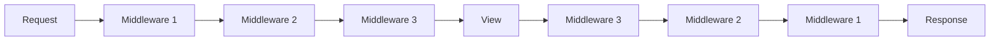

## Modelos e Banco de Dados

### Definição de Modelos

Os modelos no Django são classes Python que definem a estrutura dos dados da aplicação. Cada modelo representa uma tabela no banco de dados, e cada atributo do modelo representa um campo na tabela. O ORM (Object-Relational Mapping) do Django traduz automaticamente os modelos em tabelas no banco de dados, facilitando o trabalho com dados sem precisar escrever SQL diretamente.

Os modelos são definidos no arquivo `models.py` de cada aplicação e herdam da classe `models.Model`. Cada campo do modelo é representado por uma instância de uma classe Field (CharField, TextField, IntegerField, etc.), que define o tipo de dado e as restrições associadas.

```python
from django.db import models
from django.contrib.auth.models import User

class Categoria(models.Model):
    nome = models.CharField(max_length=100)
    descricao = models.TextField(blank=True)
    
    def __str__(self):
        return self.nome

class Artigo(models.Model):
    titulo = models.CharField(max_length=200)
    conteudo = models.TextField()
    data_publicacao = models.DateTimeField(auto_now_add=True)
    autor = models.ForeignKey(User, on_delete=models.CASCADE)
    categorias = models.ManyToManyField(Categoria)
    ativo = models.BooleanField(default=True)
    
    def __str__(self):
        return self.titulo
```

### Relações entre Modelos

O Django oferece várias maneiras de estabelecer relações entre modelos, simulando as relações de banco de dados relacionais. Essas relações podem ser definidas entre modelos da mesma aplicação ou entre modelos de aplicações diferentes.

#### Relacionamentos entre Modelos de Diferentes Aplicações

Uma das grandes vantagens da arquitetura de aplicações do Django é a capacidade de relacionar modelos entre diferentes aplicações. Isso permite uma organização modular do código, mantendo a coesão das aplicações enquanto permite a interação entre elas.

Para relacionar modelos de diferentes aplicações, basta importar o modelo da outra aplicação e estabelecer a relação normalmente:

```python
# app_pedidos/models.py
from django.db import models
from app_produtos.models import Produto  # Importando modelo de outra aplicação
from app_usuarios.models import Cliente  # Importando modelo de outra aplicação

class Pedido(models.Model):
    cliente = models.ForeignKey(Cliente, on_delete=models.CASCADE)
    data_pedido = models.DateTimeField(auto_now_add=True)
    status = models.CharField(max_length=20, choices=[
        ('pendente', 'Pendente'),
        ('pago', 'Pago'),
        ('enviado', 'Enviado'),
        ('entregue', 'Entregue')
    ])
    
    def __str__(self):
        return f"Pedido #{self.id} - {self.cliente.nome}"

class ItemPedido(models.Model):
    pedido = models.ForeignKey(Pedido, on_delete=models.CASCADE, related_name='itens')
    produto = models.ForeignKey(Produto, on_delete=models.CASCADE)  # Relação com modelo de outra aplicação
    quantidade = models.PositiveIntegerField(default=1)
    preco_unitario = models.DecimalField(max_digits=10, decimal_places=2)
    
    def __str__(self):
        return f"{self.quantidade}x {self.produto.nome} em {self.pedido}"
```

Essas relações entre aplicações permitem manter a separação de responsabilidades enquanto estabelece as conexões necessárias entre os diferentes componentes do sistema.

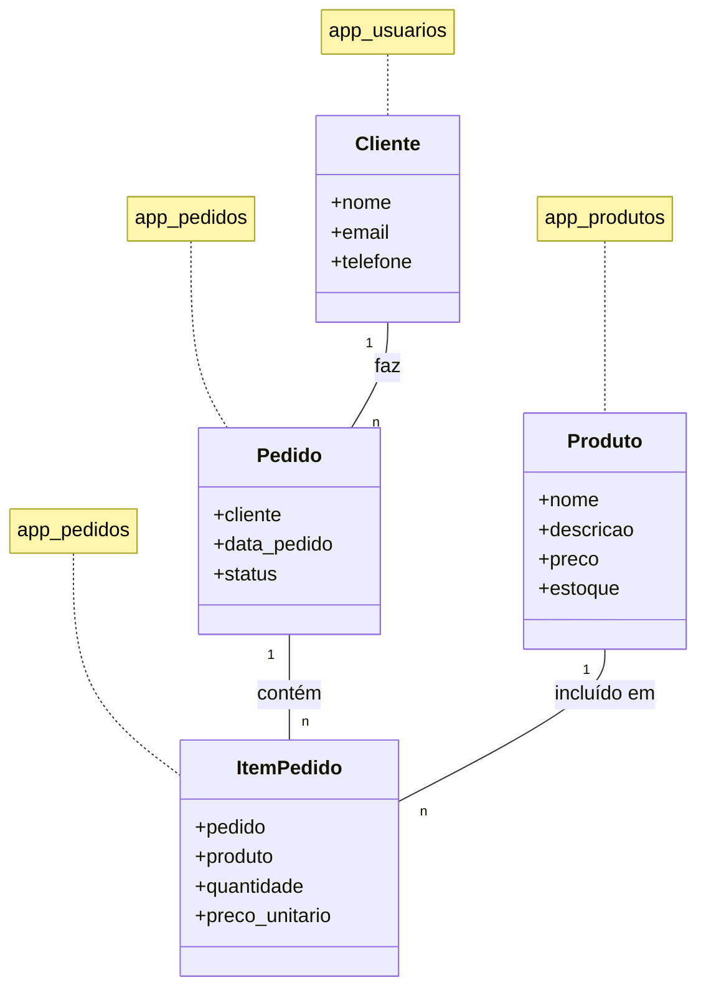

O Django cuida automaticamente dos detalhes de implementação dessas relações no banco de dados, criando as chaves estrangeiras necessárias e mantendo a integridade referencial.

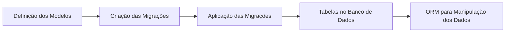

O Django suporta diferentes tipos de relações:

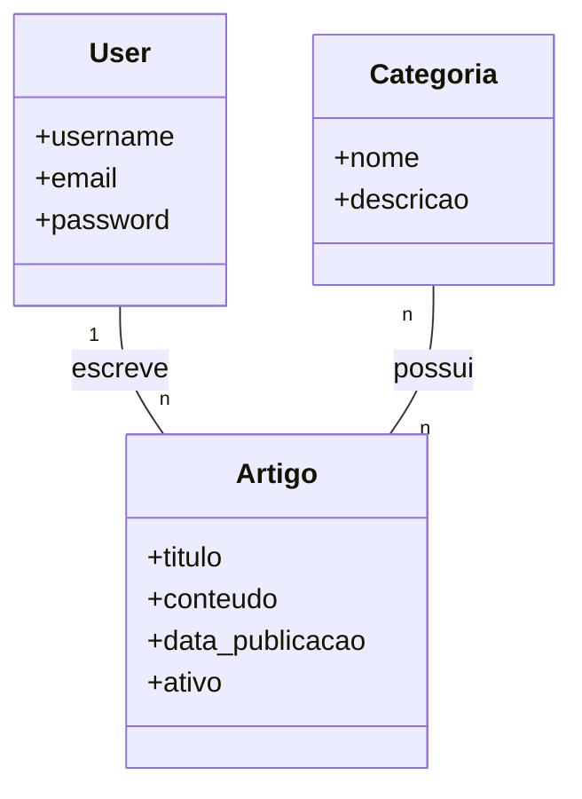

- **ForeignKey**: Relação um-para-muitos
- **ManyToManyField**: Relação muitos-para-muitos
- **OneToOneField**: Relação um-para-um

### Migrações

Migrações gerenciam alterações no esquema do banco de dados:

```bash
# Criar arquivo de migração
python manage.py makemigrations

# Aplicar migrações
python manage.py migrate

# Ver status das migrações
python manage.py showmigrations
```
 
### QuerySet API

A API QuerySet permite interagir com o banco de dados:

```python
# Buscar todos os registros
artigos = Artigo.objects.all()

# Filtrar registros
artigos_ativos = Artigo.objects.filter(ativo=True)

# Ordenar registros
artigos_recentes = Artigo.objects.order_by('-data_publicacao')

# Limitar resultados
cinco_artigos = Artigo.objects.all()[:5]

# Buscar registro único
artigo = Artigo.objects.get(id=1)

# Criar registro
artigo = Artigo.objects.create(
    titulo='Novo Artigo',
    conteudo='Conteúdo do artigo',
    autor=usuario
)

# Atualizar registro
artigo.titulo = 'Título atualizado'
artigo.save()

# Excluir registro
artigo.delete()
```

## Views e Templates

### Tipos de Views

Django suporta dois tipos principais de views:

1. **Views Baseadas em Função (FBV)**:
   - Simples e diretas
   - Mais flexíveis para lógica complexa
   - Mais código para funcionalidade padrão

2. **Views Baseadas em Classe (CBV)**:
   - Menos código repetitivo
   - Herança para reutilização
   - Views genéricas para operações comuns

```python
# Views baseadas em classe genéricas
from django.views.generic import (
    ListView, DetailView, CreateView, UpdateView, DeleteView
)

class ArtigoListView(ListView):
    model = Artigo
    template_name = 'app/artigo_list.html'
    context_object_name = 'artigos'
    paginate_by = 10
    
class ArtigoDetailView(DetailView):
    model = Artigo
    template_name = 'app/artigo_detail.html'
    
class ArtigoCreateView(CreateView):
    model = Artigo
    fields = ['titulo', 'conteudo', 'categorias']
    success_url = '/artigos/'
```

### Sistema de Templates

O sistema de templates do Django:

1. **Tags de Template**:
   - ``, ``, ``
   - ``, ``
   - ``

2. **Filtros**:
   - `{{ valor|lower }}`, `{{ valor|date:"Y-m-d" }}`
   - `{{ valor|default:"Não disponível" }}`

3. **Herança de Templates**:
   - ``
   - ``

4. **Inclusão de Templates**:
   - ``

### Arquivos Estáticos

Gerenciamento de arquivos estáticos:

```python
# settings.py
STATIC_URL = '/static/'
STATICFILES_DIRS = [BASE_DIR / 'static']
STATIC_ROOT = BASE_DIR / 'staticfiles'
```

```html

<link rel="stylesheet" href="">

```

## Django Admin

### O que é o Django Admin?

O Django Admin é uma das funcionalidades mais poderosas e destacadas do Django, oferecendo uma interface de administração web automática e sofisticada. Essa interface administrativa é gerada dinamicamente com base nos modelos definidos, exigindo pouco ou nenhum código adicional para começar a usar.

Em sua essência, o Django Admin é:

1. **Uma interface CRUD completa**: Permite Criar, Ler, Atualizar e Deletar (CRUD) registros do banco de dados
2. **Gerada automaticamente**: Cria formulários e listas baseados nos modelos e seus campos
3. **Altamente customizável**: Pode ser adaptada para atender necessidades específicas
4. **Orientada a usuários administrativos**: Destinada principalmente para uso interno por administradores do sistema
5. **Segura**: Inclui sistema de autenticação e registro de ações

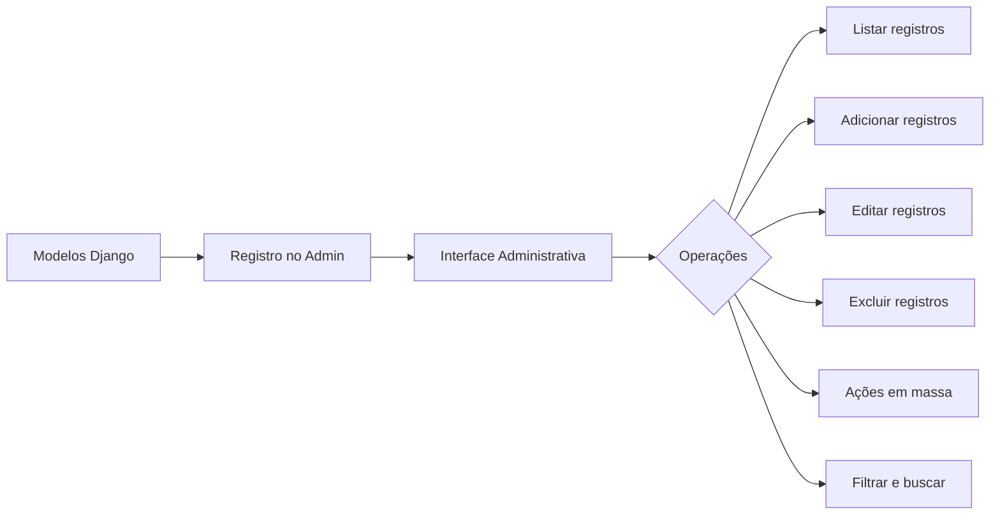

### Funcionalidades Principais

O Django Admin oferece um conjunto abrangente de funcionalidades para gerenciar dados:

- **Listagem de registros**: Exibe os registros em formato tabular com paginação
- **Filtragem e busca**: Permite filtrar e buscar registros por diferentes critérios
- **Formulários de edição**: Cria automaticamente formulários para criação e edição de registros
- **Validação de dados**: Aplica as mesmas regras de validação definidas nos modelos
- **Histórico de alterações**: Mantém um registro de quem alterou o quê e quando
- **Ações em massa**: Permite executar operações em múltiplos registros simultaneamente
- **Controle de permissões**: Restringe o acesso com base em permissões granulares

### Estrutura e Fluxo de Uso

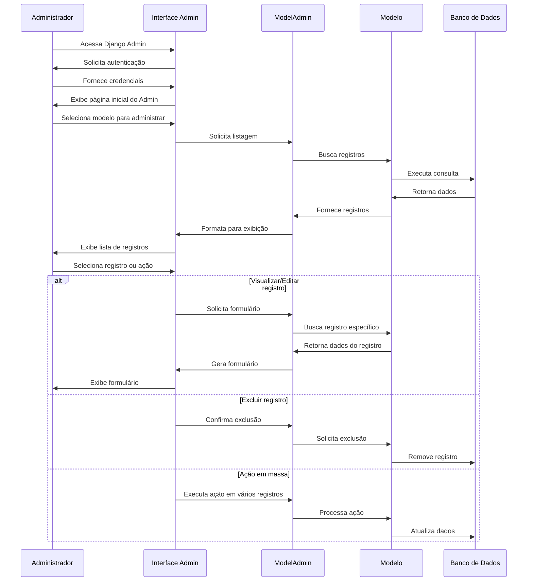

### Configuração e Uso Básico

O Django Admin já vem habilitado por padrão em novos projetos Django. Para utilizá-lo:

1. Garanta que as aplicações `django.contrib.admin` e suas dependências estejam em `INSTALLED_APPS`
2. Execute as migrações (`python manage.py migrate`)
3. Crie um superusuário (`python manage.py createsuperuser`)
4. Registre seus modelos no admin

```python
# admin.py
from django.contrib import admin
from .models import Artigo, Categoria

admin.site.register(Artigo)
admin.site.register(Categoria)
```

### Personalização Básica

```python
# admin.py
from django.contrib import admin
from .models import Artigo, Categoria

@admin.register(Categoria)
class CategoriaAdmin(admin.ModelAdmin):
    list_display = ['nome', 'descricao']
    search_fields = ['nome']

@admin.register(Artigo)
class ArtigoAdmin(admin.ModelAdmin):
    list_display = ['titulo', 'autor', 'data_publicacao', 'ativo']
    list_filter = ['ativo', 'categorias', 'data_publicacao']
    search_fields = ['titulo', 'conteudo']
    date_hierarchy = 'data_publicacao'
    filter_horizontal = ['categorias']
    prepopulated_fields = {'slug': ('titulo',)}
    
    fieldsets = [
        (None, {'fields': ['titulo', 'slug', 'conteudo']}),
        ('Categorização', {'fields': ['categorias'], 'classes': ['collapse']}),
        ('Status', {'fields': ['ativo', 'data_publicacao']})
    ]
    
    def save_model(self, request, obj, form, change):
        if not change:  # Se é uma nova instância
            obj.autor = request.user
        super().save_model(request, obj, form, change)
```

### Opções de Personalização do ModelAdmin

- **list_display**: Campos a serem exibidos na listagem
- **list_filter**: Campos a serem usados como filtros
- **search_fields**: Campos incluídos na busca
- **date_hierarchy**: Campo de data para navegação hierárquica
- **prepopulated_fields**: Campos preenchidos automaticamente
- **list_editable**: Campos editáveis diretamente na listagem
- **list_display_links**: Campos que serão links para edição
- **list_per_page**: Número de itens por página
- **ordering**: Ordenação padrão dos itens
- **readonly_fields**: Campos somente leitura no formulário
- **fields**: Define quais campos mostrar e em qual ordem
- **fieldsets**: Agrupa campos em seções
- **filter_horizontal/filter_vertical**: Melhora a interface para campos ManyToMany
- **raw_id_fields**: Usa campos de ID em vez de dropdowns para ForeignKey com muitos itens

### Ações Personalizadas

Para operações em massa, você pode definir ações personalizadas:

```python
@admin.register(Artigo)
class ArtigoAdmin(admin.ModelAdmin):
    # ... outras configurações ...
    actions = ['publicar_artigos', 'despublicar_artigos']
    
    def publicar_artigos(self, request, queryset):
        queryset.update(ativo=True)
        self.message_user(request, f'{queryset.count()} artigos foram publicados')
    publicar_artigos.short_description = 'Publicar artigos selecionados'
    
    def despublicar_artigos(self, request, queryset):
        queryset.update(ativo=False)
        self.message_user(request, f'{queryset.count()} artigos foram despublicados')
    despublicar_artigos.short_description = 'Despublicar artigos selecionados'
```

### Customização Avançada

Além de personalizar como os modelos são exibidos, você pode customizar a própria interface do admin:

```python
# Personalizar cabeçalhos e títulos
admin.site.site_header = 'Administração do Blog'
admin.site.site_title = 'Painel Admin'
admin.site.index_title = 'Bem-vindo ao Painel de Controle'

# Template personalizado para o admin
# No arquivo admin.py
class MeuModeloAdmin(admin.ModelAdmin):
    change_form_template = 'admin/meu_modelo_change_form.html'
    
# Em templates/admin/meu_modelo_change_form.html


    <p>Este é um texto de ajuda personalizado para este formulário.</p>
    {{ block.super }}

```

## Formulários

### Conceito e Importância dos Formulários

Os formulários são uma parte essencial de qualquer aplicação web, sendo o principal meio pelo qual os usuários interagem e enviam dados para o servidor. No Django, os formulários são objetos Python que:

1. Definem a estrutura e os tipos de dados de cada campo
2. Geram automaticamente HTML para renderização dos campos
3. Validam os dados enviados pelos usuários
4. Convertem os dados brutos em tipos Python apropriados

O uso de formulários do Django tem várias vantagens:

- **Segurança**: Proteção automática contra vulnerabilidades comuns
- **Validação**: Verificação da integridade e formato dos dados
- **Reutilização**: Formulários podem ser compartilhados entre diferentes views
- **Consistência**: Garantia de que os dados salvos estão no formato correto
- **Redução de código**: Menor necessidade de código repetitivo

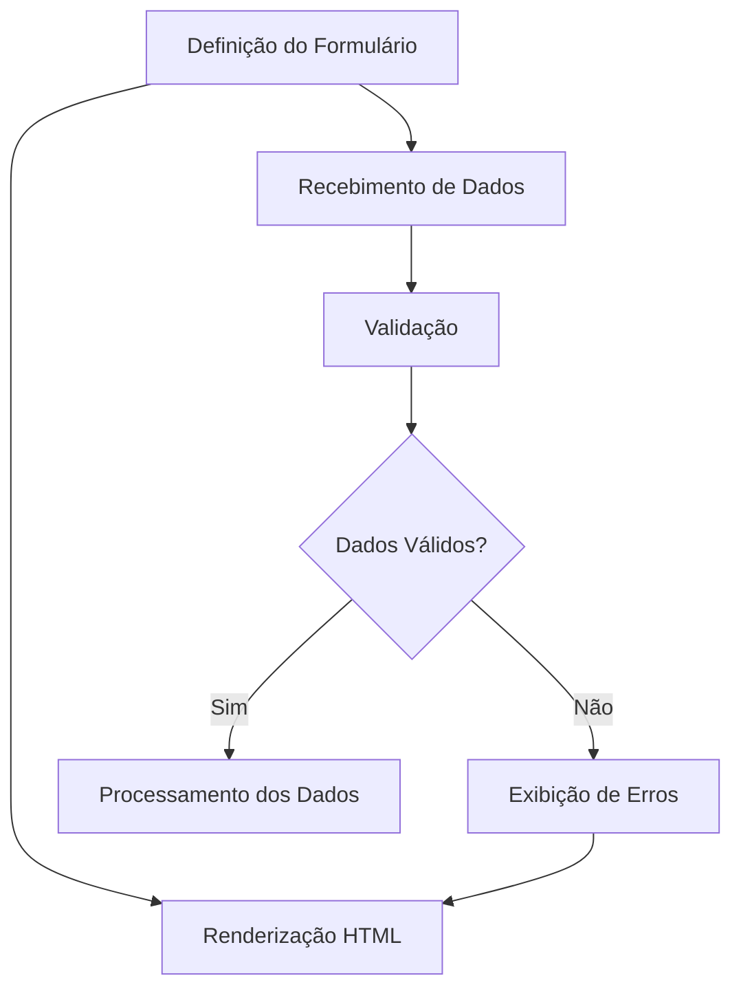

### Tipos de Formulários

O Django oferece três abordagens principais para trabalhar com formulários:

1. **Form**: Formulário manual, sem relação direta com modelos
   - Flexível e personalizado
   - Ideal para formulários que não representam um modelo específico
   - Requer mais código para salvar os dados manualmente

2. **ModelForm**: Formulário baseado em um modelo
   - Gerado automaticamente a partir de um modelo
   - Oferece validação consistente com as restrições do modelo
   - Método `save()` para persistir os dados diretamente

3. **Formulários em views genéricas**:
   - Integração automática entre modelos, formulários e templates
   - Menos código para operações CRUD comuns
   - Facilidade de personalização por meio de métodos específicos

Exemplos desses três tipos de formulários:

```python
# 1. Form (Formulário manual)
from django import forms

class ContatoForm(forms.Form):
    nome = forms.CharField(max_length=100)
    email = forms.EmailField()
    mensagem = forms.CharField(widget=forms.Textarea)
    
    def clean_email(self):
        email = self.cleaned_data.get('email')
        if not email.endswith('@exemplo.com'):
            raise forms.ValidationError('O email deve ser do domínio exemplo.com')
        return email

# 2. ModelForm (Formulário baseado em modelo)
from django.forms import ModelForm
from .models import Artigo

class ArtigoForm(ModelForm):
    class Meta:
        model = Artigo
        fields = ['titulo', 'conteudo', 'categorias']
        widgets = {
            'conteudo': forms.Textarea(attrs={'class': 'editor'})
        }
        
    def clean_titulo(self):
        titulo = self.cleaned_data.get('titulo')
        if len(titulo) < 5:
            raise forms.ValidationError('O título deve ter pelo menos 5 caracteres')
        return titulo

# 3. Formulário em view genérica
from django.views.generic.edit import CreateView
from .models import Artigo

class ArtigoCreateView(CreateView):
    model = Artigo
    fields = ['titulo', 'conteudo', 'categorias']
    template_name = 'artigo_form.html'
    success_url = '/artigos/'
    
    def form_valid(self, form):
        form.instance.autor = self.request.user
        return super().form_valid(form)
```

### Ciclo de Vida de um Formulário

O processamento de um formulário no Django segue um fluxo definido:

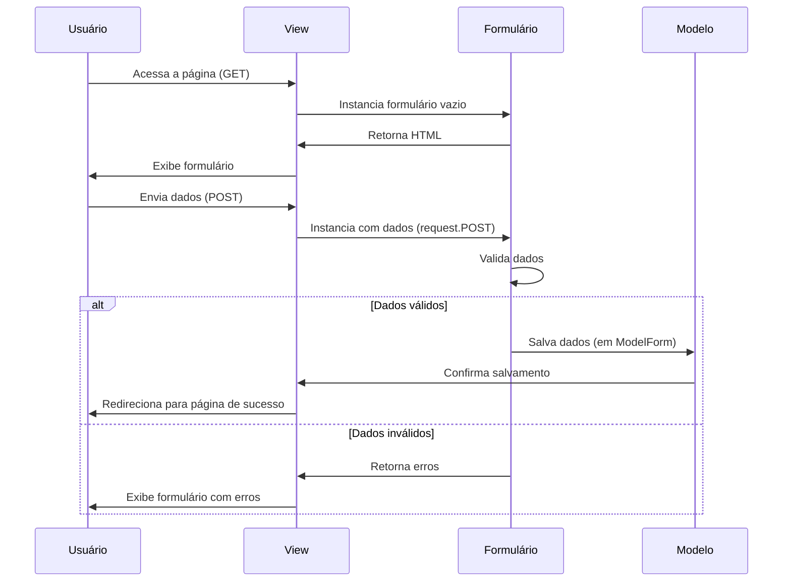

Código de view que demonstra o ciclo completo:

```python
def criar_artigo(request):
    if request.method == 'POST':
        # Formulário enviado: processa os dados
        form = ArtigoForm(request.POST)
        if form.is_valid():
            # Dados válidos: salva e redireciona
            artigo = form.save(commit=False)
            artigo.autor = request.user
            artigo.save()
            form.save_m2m()  # Salva relações ManyToMany
            messages.success(request, 'Artigo criado com sucesso!')
            return redirect('lista_artigos')
    else:
        # Requisição GET: mostra formulário vazio
        form = ArtigoForm()
    
    # Renderiza o template com o formulário (novo ou com erros)
    return render(request, 'criar_artigo.html', {'form': form})
```

### Renderização de Formulários em Templates

Os formulários podem ser renderizados de várias maneiras nos templates:

```html
<!-- Método 1: Renderização automática como tabela -->
<form method="post">
    
    {{ form.as_table }}
    <button type="submit">Enviar</button>
</form>

<!-- Método 2: Renderização automática como parágrafos -->
<form method="post">
    
    {{ form.as_p }}
    <button type="submit">Enviar</button>
</form>

<!-- Método 3: Renderização automática como lista -->
<form method="post">
    
    {{ form.as_ul }}
    <button type="submit">Enviar</button>
</form>

<!-- Método 4: Renderização manual (mais controle) -->
<form method="post">
    
    
    <div class="form-group">
        {{ form.titulo.errors }}
        <label for="{{ form.titulo.id_for_label }}">Título:</label>
        {{ form.titulo }}
    </div>
    
    <div class="form-group">
        {{ form.conteudo.errors }}
        <label for="{{ form.conteudo.id_for_label }}">Conteúdo:</label>
        {{ form.conteudo }}
    </div>
    
    <div class="form-group">
        {{ form.categorias.errors }}
        <label for="{{ form.categorias.id_for_label }}">Categorias:</label>
        {{ form.categorias }}
    </div>
    
    <button type="submit">Salvar Artigo</button>
</form>
```

### Validação de Formulários

A validação é um aspecto crucial dos formulários no Django:

1. **Validação automática**: Baseada nos tipos de campo e restrições do modelo
2. **Validação por campo**: Métodos `clean_<nome_do_campo>`
3. **Validação global**: Método `clean` para validações que envolvem múltiplos campos

```python
class RegistroForm(forms.Form):
    username = forms.CharField(max_length=30)
    email = forms.EmailField()
    senha = forms.CharField(widget=forms.PasswordInput)
    confirmar_senha = forms.CharField(widget=forms.PasswordInput)
    
    # Validação por campo
    def clean_username(self):
        username = self.cleaned_data.get('username')
        if User.objects.filter(username=username).exists():
            raise forms.ValidationError('Este nome de usuário já está em uso.')
        return username
    
    # Validação global (múltiplos campos)
    def clean(self):
        cleaned_data = super().clean()
        senha = cleaned_data.get('senha')
        confirmar_senha = cleaned_data.get('confirmar_senha')
        
        if senha and confirmar_senha and senha != confirmar_senha:
            raise forms.ValidationError('As senhas não conferem.')
        
        return cleaned_data
```

### Formulários com Arquivos

Para trabalhar com upload de arquivos, é necessário definir o tipo de campo apropriado e configurar corretamente o formulário:

```python
# Modelo
class Documento(models.Model):
    titulo = models.CharField(max_length=100)
    arquivo = models.FileField(upload_to='documentos/')
    data_upload = models.DateTimeField(auto_now_add=True)

# Formulário
class DocumentoForm(forms.ModelForm):
    class Meta:
        model = Documento
        fields = ['titulo', 'arquivo']

# View
def upload_documento(request):
    if request.method == 'POST':
        form = DocumentoForm(request.POST, request.FILES)
        if form.is_valid():
            form.save()
            return redirect('lista_documentos')
    else:
        form = DocumentoForm()
    return render(request, 'upload_documento.html', {'form': form})

# Template
'''
<form method="post" enctype="multipart/form-data">
    
    {{ form.as_p }}
    <button type="submit">Upload</button>
</form>
'''
```

### FormSets

FormSets permitem trabalhar com múltiplas instâncias do mesmo formulário na mesma página:

```python
from django.forms import formset_factory, modelformset_factory

# Criando um formset básico
ComentarioFormSet = formset_factory(ComentarioForm, extra=3)

# View com formset
def adicionar_comentarios(request, artigo_id):
    artigo = get_object_or_404(Artigo, id=artigo_id)
    
    if request.method == 'POST':
        formset = ComentarioFormSet(request.POST)
        if formset.is_valid():
            for form in formset:
                if form.cleaned_data:  # Verifica se o formulário não está vazio
                    comentario = form.save(commit=False)
                    comentario.artigo = artigo
                    comentario.autor = request.user
                    comentario.save()
            return redirect('detalhe_artigo', artigo_id=artigo.id)
    else:
        formset = ComentarioFormSet()
    
    return render(request, 'adicionar_comentarios.html', {
        'artigo': artigo,
        'formset': formset
    })
```

## Autenticação e Autorização

### Sistema de Autenticação

```python
# views.py
from django.contrib.auth import authenticate, login, logout
from django.contrib.auth.decorators import login_required

def login_view(request):
    if request.method == 'POST':
        username = request.POST['username']
        password = request.POST['password']
        user = authenticate(request, username=username, password=password)
        if user is not None:
            login(request, user)
            return redirect('home')
        else:
            return render(request, 'login.html', {'error': 'Credenciais inválidas'})
    return render(request, 'login.html')

def logout_view(request):
    logout(request)
    return redirect('login')

@login_required
def perfil(request):
    return render(request, 'perfil.html')
```

### Permissões e Grupos

```python
from django.contrib.auth.mixins import PermissionRequiredMixin

class ArtigoCreateView(PermissionRequiredMixin, CreateView):
    model = Artigo
    fields = ['titulo', 'conteudo', 'categorias']
    permission_required = 'app.add_artigo'
    
    def form_valid(self, form):
        form.instance.autor = self.request.user
        return super().form_valid(form)
```

### Controle de Acesso

```python
# Decorador para visões baseadas em função
@login_required
def editar_artigo(request, pk):
    # ...

# Mixins para visões baseadas em classe
from django.contrib.auth.mixins import (
    LoginRequiredMixin, UserPassesTestMixin
)

class ArtigoUpdateView(LoginRequiredMixin, UserPassesTestMixin, UpdateView):
    model = Artigo
    fields = ['titulo', 'conteudo', 'categorias']
    
    def test_func(self):
        artigo = self.get_object()
        return self.request.user == artigo.autor
```

## APIs com Django

### Django Rest Framework

```bash
pip install djangorestframework
```

```python
# settings.py
INSTALLED_APPS = [
    # ...
    'rest_framework',
]

# serializers.py
from rest_framework import serializers
from .models import Artigo

class ArtigoSerializer(serializers.ModelSerializer):
    class Meta:
        model = Artigo
        fields = ['id', 'titulo', 'conteudo', 'data_publicacao', 'autor', 'categorias']
        
# views.py
from rest_framework import viewsets
from .models import Artigo
from .serializers import ArtigoSerializer

class ArtigoViewSet(viewsets.ModelViewSet):
    queryset = Artigo.objects.all()
    serializer_class = ArtigoSerializer
    
# urls.py
from rest_framework.routers import DefaultRouter
from .views import ArtigoViewSet

router = DefaultRouter()
router.register('artigos', ArtigoViewSet)

urlpatterns = [
    # ...
    path('api/', include(router.urls)),
]
```

### Django Ninja

```bash
pip install django-ninja
```

```python
# api.py
from ninja import NinjaAPI, Schema
from .models import Artigo

api = NinjaAPI()

class ArtigoSchema(Schema):
    id: int
    titulo: str
    conteudo: str
    
class ArtigoInSchema(Schema):
    titulo: str
    conteudo: str

@api.get('/artigos', response=list[ArtigoSchema])
def listar_artigos(request):
    return Artigo.objects.all()

@api.get('/artigos/{artigo_id}', response=ArtigoSchema)
def obter_artigo(request, artigo_id: int):
    return Artigo.objects.get(id=artigo_id)

@api.post('/artigos', response=ArtigoSchema)
def criar_artigo(request, payload: ArtigoInSchema):
    artigo = Artigo.objects.create(
        titulo=payload.titulo,
        conteudo=payload.conteudo,
        autor=request.user
    )
    return artigo

# urls.py
from django.urls import path
from .api import api

urlpatterns = [
    # ...
    path('api/', api.urls),
]
```

## Segurança no Django

### CSRF Protection

```html
<form method="post">
    
    {{ form.as_p }}
    <button type="submit">Enviar</button>
</form>
```

### Proteção contra SQL Injection

O ORM do Django protege automaticamente contra SQL Injection ao usar QuerySets:

```python
# Seguro
usuario = User.objects.get(username=username)

# Inseguro - NUNCA FAÇA ISSO!
usuario = User.objects.raw(f"SELECT * FROM auth_user WHERE username = '{username}'")
```

### Proteção contra XSS

Django escapa automaticamente conteúdo em templates:

```html
<!-- Seguro -->
{{ artigo.conteudo }}

<!-- Inseguro - use apenas se tiver certeza que o conteúdo é seguro -->
{{ artigo.conteudo|safe }}
```

### Configurações de Segurança

```python
# settings.py
SECURE_BROWSER_XSS_FILTER = True
SECURE_CONTENT_TYPE_NOSNIFF = True
SECURE_SSL_REDIRECT = True  # Em produção
SESSION_COOKIE_SECURE = True  # Em produção
CSRF_COOKIE_SECURE = True  # Em produção
X_FRAME_OPTIONS = 'DENY'
```

### Segurança no Django Seguindo o OWASP Top 10

O OWASP Top 10 é uma lista dos riscos de segurança mais críticos para aplicações web. Vamos ver como o Django ajuda a mitigar cada um deles e quais práticas adicionais você deve adotar:

#### 1. Quebra de Controle de Acesso

**Proteções nativas do Django:**
- Sistema de autenticação e autorização robusto
- Decoradores como `@login_required` e `@permission_required`
- Mixins como `LoginRequiredMixin` e `UserPassesTestMixin`

**Práticas recomendadas:**
```python
# Verificação de propriedade em views baseadas em função
def editar_artigo(request, pk):
    artigo = get_object_or_404(Artigo, pk=pk)
    if request.user != artigo.autor:
        raise PermissionDenied
    # ...

# Verificação de propriedade em views baseadas em classe
class ArtigoUpdateView(LoginRequiredMixin, UserPassesTestMixin, UpdateView):
    model = Artigo
    fields = ['titulo', 'conteudo']
    
    def test_func(self):
        artigo = self.get_object()
        return self.request.user == artigo.autor

# Usando permissões granulares
from django.contrib.auth.decorators import permission_required

@permission_required('blog.change_artigo')
def editar_artigo(request, pk):
    # ...
```

#### 2. Falhas Criptográficas

**Proteções nativas do Django:**
- Armazenamento seguro de senhas com algoritmos como PBKDF2, Argon2 ou Bcrypt
- Geração segura de tokens para redefinição de senha

**Práticas recomendadas:**
```python
# settings.py - Configurar algoritmo de hash de senha
PASSWORD_HASHERS = [
    'django.contrib.auth.hashers.Argon2PasswordHasher',
    'django.contrib.auth.hashers.PBKDF2PasswordHasher',
    'django.contrib.auth.hashers.PBKDF2SHA1PasswordHasher',
]

# Usar HTTPS em produção
SECURE_SSL_REDIRECT = True
SESSION_COOKIE_SECURE = True
CSRF_COOKIE_SECURE = True

# Para dados sensíveis, considere criptografia em nível de campo
from django.db import models
from django_cryptography.fields import encrypt

class InformacaoPagamento(models.Model):
    usuario = models.ForeignKey(User, on_delete=models.CASCADE)
    numero_cartao = encrypt(models.CharField(max_length=16))
    cvv = encrypt(models.CharField(max_length=4))
```

#### 3. Injeção

**Proteções nativas do Django:**
- ORM que previne SQL Injection
- Escapamento automático em templates que previne XSS

**Práticas recomendadas:**
```python
# Evite usar raw SQL, mas se precisar, use parâmetros nomeados
from django.db import connection

def buscar_artigos(termo):
    with connection.cursor() as cursor:
        cursor.execute(
            "SELECT * FROM blog_artigo WHERE titulo LIKE %s",
            [f'%{termo}%']
        )
        return cursor.fetchall()

# Para comandos do sistema, use subprocess com argumentos separados
import subprocess

def converter_arquivo(arquivo_entrada, arquivo_saida):
    subprocess.run(
        ['convert', arquivo_entrada, arquivo_saida],
        check=True,
        capture_output=True,
        text=True
    )
```

#### 4. Design Inseguro

**Proteções nativas do Django:**
- Configurações seguras por padrão
- Documentação extensa sobre segurança

**Práticas recomendadas:**
- Realizar revisões de segurança regulares
- Seguir o princípio do menor privilégio
- Implementar defesa em profundidade (múltiplas camadas de segurança)
- Usar ferramentas como `django-security` para verificações adicionais

```python
# Implementar limites de taxa para evitar abuso
from django.core.cache import cache
from django.http import HttpResponseTooManyRequests

def view_com_limite_de_taxa(request):
    client_ip = request.META.get('REMOTE_ADDR')
    key = f'rate_limit_{client_ip}'
    requests = cache.get(key, 0)
    
    if requests >= 100:  # Limite de 100 requisições por hora
        return HttpResponseTooManyRequests()
    
    cache.set(key, requests + 1, 3600)  # 1 hora
    # Lógica da view...
```

#### 5. Configuração Incorreta de Segurança

**Proteções nativas do Django:**
- Configurações seguras por padrão
- Verificador de segurança integrado (`python manage.py check --deploy`)

**Práticas recomendadas:**
```python
# settings.py para produção
DEBUG = False
ALLOWED_HOSTS = ['www.seudominio.com']

# Usar variáveis de ambiente para configurações sensíveis
import os
from decouple import config, Csv

SECRET_KEY = config('SECRET_KEY')
DATABASE_PASSWORD = config('DATABASE_PASSWORD')

# Configurar cabeçalhos de segurança
SECURE_HSTS_SECONDS = 31536000  # 1 ano
SECURE_HSTS_INCLUDE_SUBDOMAINS = True
SECURE_HSTS_PRELOAD = True
SECURE_CONTENT_TYPE_NOSNIFF = True
SECURE_BROWSER_XSS_FILTER = True
X_FRAME_OPTIONS = 'DENY'
```

#### 6. Componentes Vulneráveis e Desatualizados

**Práticas recomendadas:**
- Manter o Django e todas as dependências atualizadas
- Usar ferramentas como `safety` ou `dependabot` para verificar vulnerabilidades

```bash
# Verificar vulnerabilidades nas dependências
pip install safety
safety check

# Fixar versões específicas em requirements.txt
Django==4.2.7
djangorestframework==3.14.0
```

#### 7. Falhas de Identificação e Autenticação

**Proteções nativas do Django:**
- Sistema de autenticação robusto
- Proteção contra ataques de força bruta

**Práticas recomendadas:**
```python
# settings.py - Configurar políticas de senha
AUTH_PASSWORD_VALIDATORS = [
    {'NAME': 'django.contrib.auth.password_validation.UserAttributeSimilarityValidator'},
    {'NAME': 'django.contrib.auth.password_validation.MinimumLengthValidator', 'OPTIONS': {'min_length': 12}},
    {'NAME': 'django.contrib.auth.password_validation.CommonPasswordValidator'},
    {'NAME': 'django.contrib.auth.password_validation.NumericPasswordValidator'},
]

# Implementar autenticação de dois fatores
# pip install django-two-factor-auth
INSTALLED_APPS = [
    # ...
    'django_otp',
    'django_otp.plugins.otp_totp',
    'two_factor',
]

# Implementar bloqueio de conta após tentativas falhas
from django.contrib.auth import get_user_model
from django.contrib.auth.signals import user_login_failed
from django.dispatch import receiver

@receiver(user_login_failed)
def login_failed(sender, credentials, **kwargs):
    username = credentials.get('username')
    if username:
        cache_key = f'login_attempts_{username}'
        attempts = cache.get(cache_key, 0) + 1
        cache.set(cache_key, attempts, 300)  # 5 minutos
        
        if attempts >= 5:
            User = get_user_model()
            try:
                user = User.objects.get(username=username)
                user.is_active = False
                user.save()
            except User.DoesNotExist:
                pass
```

#### 8. Falhas de Integridade de Software e Dados

**Proteções nativas do Django:**
- Validação de dados em formulários e modelos
- Sistema de migrações para manter a integridade do banco de dados

**Práticas recomendadas:**
```python
# Validação rigorosa em modelos
class Artigo(models.Model):
    titulo = models.CharField(max_length=200, validators=[
        RegexValidator(r'^[a-zA-Z0-9\s\-_]+$', 'Apenas letras, números, espaços e hífens são permitidos.')
    ])
    # ...
    
    def clean(self):
        if len(self.titulo) < 5:
            raise ValidationError('O título deve ter pelo menos 5 caracteres.')
        if self.data_publicacao and self.data_publicacao > timezone.now():
            raise ValidationError('A data de publicação não pode ser no futuro.')

# Usar transações para operações críticas
from django.db import transaction

@transaction.atomic
def transferir_fundos(origem_id, destino_id, valor):
    with transaction.atomic():
        origem = Conta.objects.select_for_update().get(id=origem_id)
        destino = Conta.objects.select_for_update().get(id=destino_id)
        
        if origem.saldo < valor:
            raise ValueError("Saldo insuficiente")
        
        origem.saldo -= valor
        destino.saldo += valor
        
        origem.save()
        destino.save()
        
        Transacao.objects.create(
            origem=origem,
            destino=destino,
            valor=valor
        )
```

#### 9. Falhas de Registro e Monitoramento

**Práticas recomendadas:**
```python
# settings.py - Configuração de logging
LOGGING = {
    'version': 1,
    'disable_existing_loggers': False,
    'formatters': {
        'verbose': {
            'format': '{levelname} {asctime} {module} {process:d} {thread:d} {message}',
            'style': '{',
        },
    },
    'handlers': {
        'file': {
            'level': 'WARNING',
            'class': 'logging.FileHandler',
            'filename': BASE_DIR / 'logs/django.log',
            'formatter': 'verbose',
        },
        'security': {
            'level': 'INFO',
            'class': 'logging.FileHandler',
            'filename': BASE_DIR / 'logs/security.log',
            'formatter': 'verbose',
        },
    },
    'loggers': {
        'django.security': {
            'handlers': ['security'],
            'level': 'INFO',
            'propagate': True,
        },
        'app.security': {
            'handlers': ['security'],
            'level': 'INFO',
            'propagate': False,
        },
    },
}

# Registrar eventos de segurança importantes
import logging
logger = logging.getLogger('app.security')

def alterar_permissoes(request, user_id):
    if not request.user.is_superuser:
        logger.warning(
            'Tentativa não autorizada de alterar permissões',
            extra={
                'user_id': request.user.id,
                'target_user_id': user_id,
                'ip': request.META.get('REMOTE_ADDR')
            }
        )
        raise PermissionDenied
    # ...
```

#### 10. Falsificação de Solicitação do Lado do Servidor (SSRF)

**Práticas recomendadas:**
```python
import ipaddress
from urllib.parse import urlparse
from django.core.exceptions import ValidationError

def validar_url(url):
    parsed = urlparse(url)
    
    # Verificar se o esquema é permitido
    if parsed.scheme not in ['http', 'https']:
        raise ValidationError("Apenas URLs HTTP(S) são permitidas")
    
    # Verificar se o host não é um IP privado
    try:
        ip = ipaddress.ip_address(parsed.netloc)
        if ip.is_private or ip.is_loopback or ip.is_reserved:
            raise ValidationError("IPs privados ou de loopback não são permitidos")
    except ValueError:
        # Não é um IP, é um nome de domínio
        pass
    
    # Lista de domínios permitidos
    dominios_permitidos = ['api.exemplo.com', 'api.servico-seguro.com']
    if parsed.netloc not in dominios_permitidos:
        raise ValidationError("Domínio não permitido")
    
    return url

def buscar_api_externa(request):
    url = request.POST.get('api_url')
    
    try:
        url_validada = validar_url(url)
        # Fazer a requisição para a URL validada
        # ...
    except ValidationError as e:
        logger.warning(
            'Tentativa de SSRF bloqueada',
            extra={
                'user_id': request.user.id,
                'url': url,
                'ip': request.META.get('REMOTE_ADDR')
            }
        )
        return HttpResponseBadRequest(str(e))
```

### Ferramentas de Segurança para Django

1. **django-security**: Fornece verificações e melhorias de segurança adicionais
2. **django-axes**: Proteção contra ataques de força bruta
3. **django-csp**: Implementação de Content Security Policy
4. **django-honeypot**: Campos de honeypot para formulários
5. **django-defender**: Proteção contra ataques de força bruta baseada em cache
6. **django-session-security**: Expiração de sessão por inatividade

```bash
# Instalação de ferramentas de segurança
pip install django-security django-axes django-csp django-honeypot
```

```python
# settings.py
INSTALLED_APPS = [
    # ...
    'security',
    'axes',
    'csp',
    'honeypot',
]

MIDDLEWARE = [
    # ...
    'axes.middleware.AxesMiddleware',
    'csp.middleware.CSPMiddleware',
    'security.middleware.DoNotTrackMiddleware',
    'security.middleware.ContentNoSniffMiddleware',
    'security.middleware.XssProtectMiddleware',
]

# Configuração do django-axes
AXES_FAILURE_LIMIT = 5
AXES_COOLOFF_TIME = 1  # 1 hora
AXES_LOCKOUT_TEMPLATE = 'seguranca/bloqueado.html'

# Configuração do django-csp
CSP_DEFAULT_SRC = ("'self'",)
CSP_SCRIPT_SRC = ("'self'", 'cdn.exemplo.com')
CSP_STYLE_SRC = ("'self'", 'cdn.exemplo.com')
CSP_IMG_SRC = ("'self'", 'cdn.exemplo.com', 'data:')
CSP_FONT_SRC = ("'self'", 'fonts.googleapis.com', 'fonts.gstatic.com')

# Configuração do django-honeypot
HONEYPOT_FIELD_NAME = 'email_confirm'
HONEYPOT_VALUE = ''
```

### Checklist de Segurança para Projetos Django

1. **Configurações Básicas**
   - [ ] DEBUG = False em produção
   - [ ] SECRET_KEY única e segura
   - [ ] ALLOWED_HOSTS configurado corretamente
   - [ ] Usar HTTPS em produção

2. **Autenticação e Autorização**
   - [ ] Políticas de senha fortes
   - [ ] Autenticação de dois fatores (quando possível)
   - [ ] Verificação adequada de permissões em todas as views
   - [ ] Proteção contra ataques de força bruta

3. **Proteção de Dados**
   - [ ] Validação rigorosa de entrada de dados
   - [ ] Sanitização de saída de dados
   - [ ] Criptografia para dados sensíveis
   - [ ] Uso de transações para operações críticas

4. **Proteção contra Ataques Comuns**
   - [ ] Proteção CSRF em todos os formulários
   - [ ] Proteção contra XSS
   - [ ] Proteção contra SSRF
   - [ ] Proteção contra clickjacking (X-Frame-Options)

5. **Monitoramento e Resposta**
   - [ ] Logging adequado de eventos de segurança
   - [ ] Monitoramento de atividades suspeitas
   - [ ] Plano de resposta a incidentes
   - [ ] Backups regulares e testados

6. **Manutenção**
   - [ ] Django e dependências atualizadas
   - [ ] Verificação regular de vulnerabilidades
   - [ ] Testes de segurança periódicos
   - [ ] Revisão de código com foco em segurança

## Testes no Django

### Testes Unitários

```python
# tests.py
from django.test import TestCase
from django.contrib.auth.models import User
from .models import Artigo

class ArtigoModelTest(TestCase):
    @classmethod
    def setUpTestData(cls):
        # Configuração que é executada apenas uma vez
        test_user = User.objects.create_user(username='testuser', password='12345')
        Artigo.objects.create(
            titulo='Título de teste',
            conteudo='Conteúdo de teste',
            autor=test_user
        )
    
    def test_titulo_max_length(self):
        artigo = Artigo.objects.get(id=1)
        max_length = artigo._meta.get_field('titulo').max_length
        self.assertEqual(max_length, 200)
    
    def test_object_name_is_titulo(self):
        artigo = Artigo.objects.get(id=1)
        self.assertEqual(str(artigo), artigo.titulo)
```

### Testes de Visão

```python
from django.test import TestCase
from django.urls import reverse

class ArtigoListViewTest(TestCase):
    @classmethod
    def setUpTestData(cls):
        # Criar artigos para testes
        test_user = User.objects.create_user(username='testuser', password='12345')
        for i in range(10):
            Artigo.objects.create(
                titulo=f'Título {i}',
                conteudo=f'Conteúdo {i}',
                autor=test_user
            )
    
    def test_view_url_exists(self):
        response = self.client.get('/artigos/')
        self.assertEqual(response.status_code, 200)
    
    def test_view_url_accessible_by_name(self):
        response = self.client.get(reverse('artigo_list'))
        self.assertEqual(response.status_code, 200)
    
    def test_view_uses_correct_template(self):
        response = self.client.get(reverse('artigo_list'))
        self.assertEqual(response.status_code, 200)
        self.assertTemplateUsed(response, 'app/artigo_list.html')
    
    def test_pagination_is_five(self):
        response = self.client.get(reverse('artigo_list'))
        self.assertEqual(response.status_code, 200)
        self.assertTrue('is_paginated' in response.context)
        self.assertTrue(response.context['is_paginated'] == True)
        self.assertEqual(len(response.context['artigos']), 5)
```

### Teste de Formulários

```python
from django.test import TestCase
from .forms import ArtigoForm

class ArtigoFormTest(TestCase):
    def test_form_titulo_field_label(self):
        form = ArtigoForm()
        self.assertTrue(form.fields['titulo'].label == 'Título' or form.fields['titulo'].label == None)
    
    def test_form_validation_for_blank_titulo(self):
        form = ArtigoForm(data={'titulo': '', 'conteudo': 'Conteúdo de teste'})
        self.assertFalse(form.is_valid())
    
    def test_form_validation_for_short_titulo(self):
        form = ArtigoForm(data={'titulo': 'Abc', 'conteudo': 'Conteúdo de teste'})
        self.assertFalse(form.is_valid())
```

## Implantação e DevOps

### Preparação para Produção

```python
# settings.py
DEBUG = False
ALLOWED_HOSTS = ['seudominio.com', 'www.seudominio.com']

# Arquivos estáticos
STATIC_ROOT = '/caminho/para/staticfiles/'
MEDIA_ROOT = '/caminho/para/mediafiles/'

# Configurações de banco de dados
DATABASES = {
    'default': {
        'ENGINE': 'django.db.backends.postgresql',
        'NAME': 'nome_do_banco',
        'USER': 'usuario',
        'PASSWORD': 'senha',
        'HOST': 'localhost',
        'PORT': '5432',
    }
}
```

### Servidor Web e WSGI

```
# Estrutura típica
Cliente <-> Nginx <-> Gunicorn <-> Django
```

```bash
# Instalação
pip install gunicorn

# Executar
gunicorn projeto.wsgi:application --bind 0.0.0.0:8000
```

### Docker e Django

```dockerfile
# Dockerfile
FROM python:3.9-slim

WORKDIR /app

COPY requirements.txt .
RUN pip install --no-cache-dir -r requirements.txt

COPY . .

EXPOSE 8000

CMD ["gunicorn", "projeto.wsgi:application", "--bind", "0.0.0.0:8000"]
```

```yaml
# docker-compose.yml
version: '3'

services:
  db:
    image: postgres:13
    volumes:
      - postgres_data:/var/lib/postgresql/data/
    env_file:
      - ./.env.db
  
  web:
    build: .
    command: gunicorn projeto.wsgi:application --bind 0.0.0.0:8000
    volumes:
      - .:/app
      - static_volume:/app/staticfiles
      - media_volume:/app/mediafiles
    ports:
      - "8000:8000"
    depends_on:
      - db
    env_file:
      - ./.env
  
  nginx:
    image: nginx:latest
    ports:
      - "80:80"
    volumes:
      - ./nginx/conf.d:/etc/nginx/conf.d
      - static_volume:/home/app/staticfiles
      - media_volume:/home/app/mediafiles
    depends_on:
      - web

volumes:
  postgres_data:
  static_volume:
  media_volume:
```

## Otimização de Performance

### Otimização de Consultas

```python
# Consultas N+1
# Problema:
artigos = Artigo.objects.all()
for artigo in artigos:
    print(artigo.autor.username)  # Gera uma consulta para cada artigo

# Solução:
artigos = Artigo.objects.select_related('autor').all()
for artigo in artigos:
    print(artigo.autor.username)  # Usa dados já carregados
```

```python
# Para relações ManyToMany
# Problema:
artigos = Artigo.objects.all()
for artigo in artigos:
    print([c.nome for c in artigo.categorias.all()])  # Consulta para cada artigo

# Solução:
artigos = Artigo.objects.prefetch_related('categorias').all()
for artigo in artigos:
    print([c.nome for c in artigo.categorias.all()])  # Usa dados já carregados
```

### Indexação de Banco de Dados

```python
class Artigo(models.Model):
    titulo = models.CharField(max_length=200)
    slug = models.SlugField(max_length=200, unique=True)
    data_publicacao = models.DateTimeField(auto_now_add=True, db_index=True)
    
    class Meta:
        indexes = [
            models.Index(fields=['titulo']),
            models.Index(fields=['data_publicacao', 'titulo']),
        ]
```

### Caching

```python
# settings.py
CACHES = {
    'default': {
        'BACKEND': 'django.core.cache.backends.redis.RedisCache',
        'LOCATION': 'redis://127.0.0.1:6379/1',
    }
}

# Cache de visão
from django.views.decorators.cache import cache_page

@cache_page(60 * 15)  # Cache por 15 minutos
def lista_artigos(request):
    artigos = Artigo.objects.all()
    return render(request, 'app/lista_artigos.html', {'artigos': artigos})

# Cache de template


    {# Conteúdo que será cacheado #}


# Cache de consulta
from django.core.cache import cache

def get_artigos_populares():
    cache_key = 'artigos_populares'
    artigos = cache.get(cache_key)
    if not artigos:
        artigos = Artigo.objects.filter(popular=True)[:10]
        cache.set(cache_key, artigos, 60 * 60)  # Cache por 1 hora
    return artigos
```

### Otimização de Arquivos Estáticos

```python
# settings.py
STATICFILES_STORAGE = 'django.contrib.staticfiles.storage.ManifestStaticFilesStorage'
```

```bash
# Coletar arquivos estáticos
python manage.py collectstatic

# Compressão de arquivos estáticos
pip install django-compressor

# settings.py
INSTALLED_APPS = [
    # ...
    'compressor',
]

STATICFILES_FINDERS = [
    'django.contrib.staticfiles.finders.FileSystemFinder',
    'django.contrib.staticfiles.finders.AppDirectoriesFinder',
    'compressor.finders.CompressorFinder',
]

COMPRESS_ENABLED = True
COMPRESS_CSS_FILTERS = ['compressor.filters.css_default.CssAbsoluteFilter', 'compressor.filters.cssmin.CSSMinFilter']
COMPRESS_JS_FILTERS = ['compressor.filters.jsmin.JSMinFilter']
```

```html



<link rel="stylesheet" href="">
<link rel="stylesheet" href="">



<script src=""></script>
<script src=""></script>

```

### Paginação

```python
from django.core.paginator import Paginator

def lista_artigos(request):
    artigos_lista = Artigo.objects.all()
    paginator = Paginator(artigos_lista, 10)  # 10 artigos por página
    
    page = request.GET.get('page')
    artigos = paginator.get_page(page)
    
    return render(request, 'app/lista_artigos.html', {'artigos': artigos})
```

```html
<div class="pagination">
    <span class="step-links">
        
            <a href="?page=1">&laquo; primeira</a>
            <a href="?page={{ artigos.previous_page_number }}">anterior</a>
        

        <span class="current">
            Página {{ artigos.number }} de {{ artigos.paginator.num_pages }}.
        </span>

        
            <a href="?page={{ artigos.next_page_number }}">próxima</a>
            <a href="?page={{ artigos.paginator.num_pages }}">última &raquo;</a>
        
    </span>
</div>
```

### Monitoramento de Performance

```python
# Instalação
pip install django-debug-toolbar

# settings.py
INSTALLED_APPS = [
    # ...
    'debug_toolbar',
]

MIDDLEWARE = [
    # ...
    'debug_toolbar.middleware.DebugToolbarMiddleware',
]

INTERNAL_IPS = [
    '127.0.0.1',
]

# urls.py
if settings.DEBUG:
    import debug_toolbar
    urlpatterns = [
        path('__debug__/', include(debug_toolbar.urls)),
    ] + urlpatterns
```

## Padrões e Práticas Recomendadas

### Estrutura de Projeto

```
projeto/
├── apps/                  # Todas as aplicações do projeto
│   ├── core/              # Funcionalidades centrais
│   ├── users/             # Gerenciamento de usuários
│   └── blog/              # Funcionalidades de blog
├── config/                # Configurações do projeto
│   ├── settings/
│   │   ├── base.py        # Configurações base
│   │   ├── local.py       # Configurações de desenvolvimento
│   │   └── production.py  # Configurações de produção
│   ├── urls.py
│   └── wsgi.py
├── static/                # Arquivos estáticos
├── templates/             # Templates globais
├── media/                 # Arquivos de mídia
├── docs/                  # Documentação
├── requirements/
│   ├── base.txt           # Dependências base
│   ├── local.txt          # Dependências de desenvolvimento
│   └── production.txt     # Dependências de produção
├── manage.py
└── README.md
```

### Padrões de Código

```python
# Nomes de classes em CamelCase
class MinhaClasse:
    pass

# Nomes de funções e variáveis em snake_case
def minha_funcao():
    minha_variavel = 10
    return minha_variavel

# Constantes em MAIÚSCULAS
NUMERO_MAXIMO_DE_TENTATIVAS = 3

# Docstrings para documentação
def calcular_total(valores):
    """
    Calcula a soma de uma lista de valores.
    
    Args:
        valores (list): Lista de números para somar.
        
    Returns:
        float: A soma dos valores.
        
    Raises:
        TypeError: Se valores não for uma lista ou se contiver elementos não numéricos.
    """
    return sum(valores)
```

### Fat Models, Thin Views

```python
# models.py - Lógica de negócio no modelo
class Artigo(models.Model):
    # ...
    
    def publicar(self):
        self.status = 'publicado'
        self.data_publicacao = timezone.now()
        self.save()
    
    def despublicar(self):
        self.status = 'rascunho'
        self.save()
    
    def get_comentarios_aprovados(self):
        return self.comentarios.filter(aprovado=True)
    
    def get_categorias_ordenadas(self):
        return self.categorias.order_by('nome')

# views.py - View simples que usa métodos do modelo
def publicar_artigo(request, pk):
    artigo = get_object_or_404(Artigo, pk=pk)
    if request.user == artigo.autor:
        artigo.publicar()
    return redirect('artigo_detalhe', pk=artigo.pk)
```

### Service Layer

```python
# services.py
class ArtigoService:
    @staticmethod
    def criar_artigo(titulo, conteudo, autor, categorias=None):
        artigo = Artigo.objects.create(
            titulo=titulo,
            conteudo=conteudo,
            autor=autor
        )
        
        if categorias:
            artigo.categorias.add(*categorias)
        
        # Enviar notificação, gerar log, etc.
        
        return artigo
    
    @staticmethod
    def publicar_artigo(artigo_id, usuario):
        artigo = Artigo.objects.get(id=artigo_id)
        
        if usuario != artigo.autor and not usuario.is_staff:
            raise PermissionError("Usuário não tem permissão para publicar este artigo")
        
        artigo.publicar()
        
        # Enviar e-mail, notificar seguidores, etc.
        
        return artigo

# views.py
def criar_artigo(request):
    if request.method == 'POST':
        form = ArtigoForm(request.POST)
        if form.is_valid():
            try:
                artigo = ArtigoService.criar_artigo(
                    titulo=form.cleaned_data['titulo'],
                    conteudo=form.cleaned_data['conteudo'],
                    autor=request.user,
                    categorias=form.cleaned_data['categorias']
                )
                return redirect('artigo_detalhe', pk=artigo.pk)
            except Exception as e:
                form.add_error(None, str(e))
    else:
        form = ArtigoForm()
    return render(request, 'app/artigo_form.html', {'form': form})
```

### Signals para Desacoplamento

```python
# signals.py
from django.db.models.signals import post_save
from django.dispatch import receiver
from .models import Artigo

@receiver(post_save, sender=Artigo)
def artigo_post_save(sender, instance, created, **kwargs):
    if created:
        # Lógica para novo artigo
        pass
    else:
        # Lógica para artigo atualizado
        pass

# apps.py
from django.apps import AppConfig

class BlogConfig(AppConfig):
    default_auto_field = 'django.db.models.BigAutoField'
    name = 'blog'
    
    def ready(self):
        import blog.signals  # Importar signals quando a aplicação estiver pronta
```

### Mixins para Reutilização

```python
class OwnerRequiredMixin:
    """Mixin que verifica se o usuário é dono do objeto."""
    
    def dispatch(self, request, *args, **kwargs):
        obj = self.get_object()
        if obj.autor != request.user:
            return self.handle_no_permission()
        return super().dispatch(request, *args, **kwargs)

class ArtigoUpdateView(LoginRequiredMixin, OwnerRequiredMixin, UpdateView):
    model = Artigo
    fields = ['titulo', 'conteudo', 'categorias']
    template_name = 'app/artigo_form.html'
```

### Gerenciamento de Configurações

```python
# settings/base.py
import os
from pathlib import Path
from decouple import config, Csv

BASE_DIR = Path(__file__).resolve().parent.parent.parent

SECRET_KEY = config('SECRET_KEY')

INSTALLED_APPS = [
    'django.contrib.admin',
    'django.contrib.auth',
    'django.contrib.contenttypes',
    'django.contrib.sessions',
    'django.contrib.messages',
    'django.contrib.staticfiles',
    
    # Apps de terceiros
    'rest_framework',
    'crispy_forms',
    
    # Apps do projeto
    'apps.core',
    'apps.users',
    'apps.blog',
]

# settings/local.py
from .base import *

DEBUG = True
ALLOWED_HOSTS = ['localhost', '127.0.0.1']

DATABASES = {
    'default': {
        'ENGINE': 'django.db.backends.sqlite3',
        'NAME': BASE_DIR / 'db.sqlite3',
    }
}

# settings/production.py
from .base import *

DEBUG = False
ALLOWED_HOSTS = config('ALLOWED_HOSTS', cast=Csv())

DATABASES = {
    'default': {
        'ENGINE': 'django.db.backends.postgresql',
        'NAME': config('DB_NAME'),
        'USER': config('DB_USER'),
        'PASSWORD': config('DB_PASSWORD'),
        'HOST': config('DB_HOST'),
        'PORT': config('DB_PORT', cast=int),
    }
}

# Configurações de segurança
SECURE_SSL_REDIRECT = True
SESSION_COOKIE_SECURE = True
CSRF_COOKIE_SECURE = True
```

## Recursos Adicionais

### Documentação Oficial

- [Documentação do Django](https://docs.djangoproject.com/)
- [Tutorial do Django](https://docs.djangoproject.com/en/stable/intro/tutorial01/)
- [Referência da API do Django](https://docs.djangoproject.com/en/stable/ref/)
- [Tópicos Avançados do Django](https://docs.djangoproject.com/en/stable/topics/)

### Livros Recomendados

- "Django for Professionals" por William S. Vincent
- "Two Scoops of Django" por Daniel Roy Greenfeld e Audrey Roy Greenfeld
- "Django 3 By Example" por Antonio Melé
- "Test-Driven Development with Python" por Harry Percival

### Cursos Online

- [Django for Everybody](https://www.dj4e.com/) por Charles Severance
- [Django Web Framework - Full Course for Beginners](https://www.youtube.com/watch?v=F5mRW0jo-U4) por freeCodeCamp
- [Django - The Complete Masterclass](https://www.udemy.com/course/django-the-complete-masterclass/) na Udemy
- [Django for APIs](https://djangoforapis.com/) por William S. Vincent

### Blogs e Sites

- [Django News](https://django-news.com/)
- [Django Stars Blog](https://djangostars.com/blog/)
- [Real Python - Django Tutorials](https://realpython.com/tutorials/django/)
- [Awesome Django](https://github.com/wsvincent/awesome-django) - Lista curada de recursos

### Pacotes e Extensões Úteis

- [Django REST Framework](https://www.django-rest-framework.org/) - Criação de APIs
- [Django Crispy Forms](https://django-crispy-forms.readthedocs.io/) - Formulários elegantes
- [Django Debug Toolbar](https://django-debug-toolbar.readthedocs.io/) - Depuração
- [Django Allauth](https://django-allauth.readthedocs.io/) - Autenticação avançada
- [Django Filter](https://django-filter.readthedocs.io/) - Filtragem de querysets
- [Django Channels](https://channels.readthedocs.io/) - WebSockets e comunicação assíncrona
- [Django Celery](https://docs.celeryq.dev/en/stable/django/first-steps-with-django.html) - Tarefas assíncronas
- [Django Storages](https://django-storages.readthedocs.io/) - Armazenamento em nuvem

### Comunidade

- [Django Forum](https://forum.djangoproject.com/)
- [Stack Overflow - Tag Django](https://stackoverflow.com/questions/tagged/django)
- [Reddit r/django](https://www.reddit.com/r/django/)
- [Discord Django Community](https://discord.com/invite/xcRH6mN4fa)
- [Django Chat Podcast](https://djangochat.com/)

### Conferências

- [DjangoCon US](https://djangocon.us/)
- [DjangoCon Europe](https://djangocon.eu/)
- [DjangoCon Australia](https://djangocon.com.au/)
- [PyCon (várias edições globais)](https://pycon.org/)

### Contribuindo para o Django

- [Contribuindo para o Django](https://docs.djangoproject.com/en/stable/internals/contributing/)
- [Código de Conduta do Django](https://www.djangoproject.com/conduct/)
- [Repositório do Django no GitHub](https://github.com/django/django)
- [Django Software Foundation](https://www.djangoproject.com/foundation/)

## Views e Templates

### Conceito e Função das Views

As Views são o componente do padrão MVT (Model-View-Template) responsável por processar as requisições HTTP e retornar respostas adequadas. Em essência, uma View é uma função ou classe Python que recebe uma requisição web e retorna uma resposta web, geralmente renderizando um template HTML com dados contextuais.

As Views atuam como o "controlador" da aplicação, orquestrando o fluxo de dados entre o modelo e o template:

1. Recebem requisições do cliente
2. Interagem com os modelos para buscar ou manipular dados
3. Processam os dados conforme necessário
4. Passam os dados para os templates
5. Retornam a resposta final ao cliente

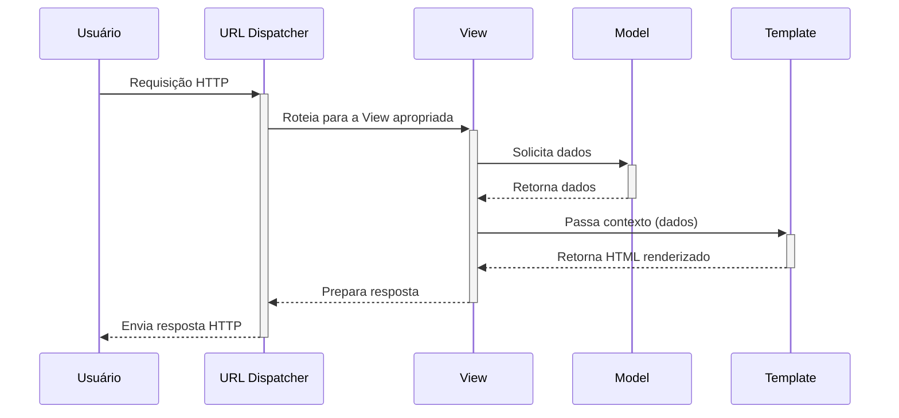

### Tipos de Views

Django suporta dois tipos principais de views:

1. **Views Baseadas em Função (FBV)**:
   - São funções Python que recebem pelo menos um argumento, a requisição (`request`)
   - São simples e diretas, fáceis de entender
   - Oferecem mais flexibilidade para lógica complexa ou não-convencional
   - Requerem mais código para implementar funcionalidades padrão
   - Ideais para views com lógica específica e única

2. **Views Baseadas em Classe (CBV)**:
   - São classes Python que herdam de `View` ou de outras views genéricas
   - Organizam o código por método HTTP (get, post, etc.)
   - Promovem reutilização de código através de herança e mixins
   - Reduzem código repetitivo para padrões comuns (listar, detalhar, criar, etc.)
   - Oferecem views genéricas para operações CRUD comuns
   - Ideais para funcionalidades padrão como listar, detalhar, criar, atualizar e excluir registros

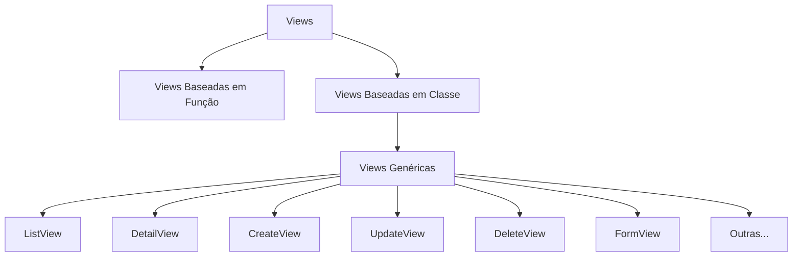

```python
# Views baseadas em função (FBV)
from django.shortcuts import render, get_object_or_404
from .models import Artigo

def lista_artigos(request):
    artigos = Artigo.objects.filter(ativo=True).order_by('-data_publicacao')
    return render(request, 'blog/lista_artigos.html', {'artigos': artigos})

def detalhe_artigo(request, artigo_id):
    artigo = get_object_or_404(Artigo, id=artigo_id, ativo=True)
    return render(request, 'blog/detalhe_artigo.html', {'artigo': artigo})

# Views baseadas em classe genéricas
from django.views.generic import (
    ListView, DetailView, CreateView, UpdateView, DeleteView
)

class ArtigoListView(ListView):
    model = Artigo
    template_name = 'app/artigo_list.html'
    context_object_name = 'artigos'
    paginate_by = 10
    
class ArtigoDetailView(DetailView):
    model = Artigo
    template_name = 'app/artigo_detail.html'
    
class ArtigoCreateView(CreateView):
    model = Artigo
    fields = ['titulo', 'conteudo', 'categorias']
    success_url = '/artigos/'
```

### Sistema de Templates

O sistema de templates do Django é uma poderosa ferramenta para criar páginas dinâmicas. Um template é um arquivo de texto que define a estrutura ou layout de um arquivo (como HTML), com marcadores especiais que descrevem como os dados dinâmicos devem ser inseridos.

Os objetivos principais do sistema de templates são:
1. Separar a lógica de apresentação da lógica de negócios
2. Permitir a reutilização de elementos de interface
3. Facilitar a manutenção e organização do código HTML
4. Oferecer uma sintaxe intuitiva para adicionar dinamismo às páginas

O sistema de templates do Django consiste em três componentes principais:

1. **Tags de Template**: Controlam a lógica do template (condicionais, loops, etc.)
   - ``, ``, ``
   - ``, ``
   - ``

2. **Filtros**: Modificam variáveis para exibição
   - `{{ valor|lower }}` (converte para minúsculas)
   - `{{ texto|truncatewords:50 }}` (limita a 50 palavras)
   - `{{ lista|length }}` (retorna o tamanho da lista)

3. **Sistema de Herança de Templates**: Permite definir um template base e estendê-lo em outros templates
   - Template base define blocos (``)
   - Templates filhos substituem ou complementam esses blocos

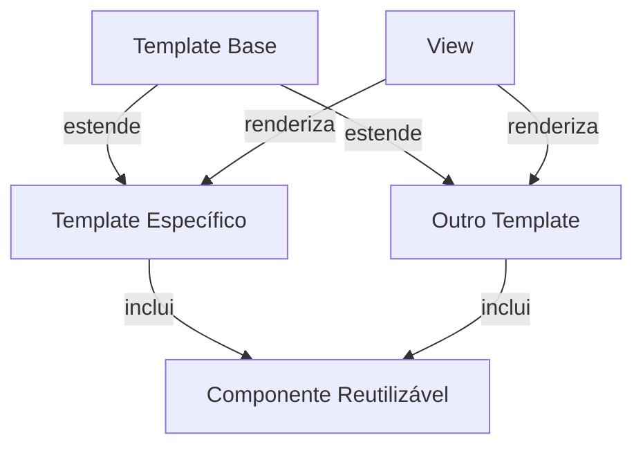

Exemplo de hierarquia de templates:

```
templates/
├── base.html               # Template base com estrutura geral
├── components/
│   ├── navbar.html         # Componente da barra de navegação
│   └── footer.html         # Componente do rodapé
├── blog/
│   ├── lista_artigos.html  # Estende base.html
│   └── detalhe_artigo.html # Estende base.html
└── users/
    ├── login.html          # Estende base.html
    └── profile.html        # Estende base.html
```
